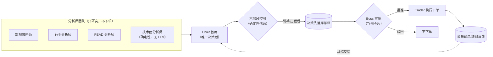
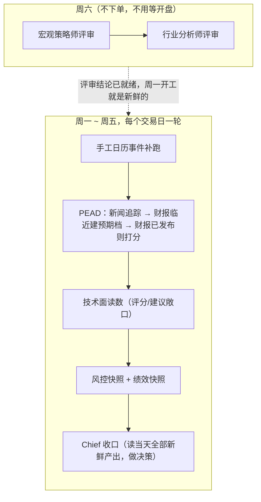
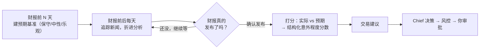

# ats —— 一个「分析师团队 + 唯一决策者 + 人工审批」的美股交易系统

这不是一个自动下单机器人。它是给一个人（下文统一称 **Boss**，也就是你）配的一支
虚拟研究/交易团队：一群 AI「分析师」每天做研究、追踪财报、盯风控，把结论汇总给
唯一的「决策者」，决策者拟好交易建议后**必须经过你在飞书上点一下批准，才会真的
下单**。系统里没有任何路径可以绕开这一下点击。

如果你只想知道"我每天要做什么"，直接跳到 [你每天要做的事](#你每天要做的事)。
如果你想知道"这套系统为什么这么设计"，往下读。

---

## 设计思想

这套系统的每一个结构性决定，背后都是在回答同一个问题：**一个人怎么用 AI 帮自己
管理真实资金，又不把决策权和风控彻底交出去？** 具体落到几条硬性原则：

1. **分析和决策分开。** 系统里有好几个"分析师"角色（宏观、行业、财报事件），
   它们每天产出研究报告、给出交易**建议**，但**没有一个分析师能真的下单**。
   所有建议最后都要汇总到唯一一个"首席"（Chief）那里，由它综合全部信息做出
   最终交易决策。这样任何一个分析师的判断出错，影响的只是"一条输入"，不会
   直接变成一笔交易。

2. **风控是硬约束，不是建议，而且永远排在审批之前。** 六层风控（单票仓位、
   组合杠杆/现金、beta/相关性、回撤、压力测试、财报事件风险）全部是**确定性
   代码**算出来的，不经过任何 LLM 判断，只会削减或拦截交易、不会自己制造交易。
   你在飞书上看到的审批卡片，已经是风控筛过、削减过的版本——你看到的从来
   不是"AI 原始的冲动"，而是"AI 的想法过完风控闸门之后剩下的东西"。

3. **人工审批是全系统唯一的安全阀，没有例外。** 不管交易是"每日收口"自动
   触发的，还是"某只票刚发了财报"触发的，还是你自己手动下的单——**所有
   下单路径最终都汇入同一张决策图，卡在同一个审批点上**。系统里有一个
   `--yes`（自动批准）的开关，但那只用于离线冒烟测试，**实盘环境下绝对不能
   打开**——这等于把审批阀门焊死在"通过"的位置。

4. **确定性代码和 LLM 判断，职责分得很清楚。** 风控阈值、仓位计算、加权打分、
   决策树，这些"数值/规则类"的东西全部是普通代码，可审计、可复现、不会因为
   模型换了一版就悄悄漂移。LLM 只负责"语义类"的判断——读懂一段财报电话会
   在说什么、这次的营收算不算超预期、行业最近有什么重大变化。这条分工线让
   系统的关键数字始终有据可查，而不是"模型说了算"。

5. **零交易是正确的默认结果。** 系统不会为了"今天要有动作"而制造交易。多数
   交易日，Chief 读完全部报告后的正确结论就是"维持不动"——这种情况下它甚至
   不会给你发审批卡，安静的一天不该有打扰。

---

## 系统里的"人"（agent 角色一览）

| 角色 | 做什么 | 能不能下单 |
|---|---|---|
| **宏观策略师** | 每周六（或遇到 FOMC/CPI/非农这类大事件时）分析宏观环境——利率路径、市场情绪、板块该往哪儿倾斜 | 不能 |
| **行业分析师** | 每周六分层评审所在产业链（目前主要是 AI 硬件产业链，从需求端到设备端分六层看），判断哪一层景气度在变化 | 不能 |
| **PEAD 分析师** | 财报事件驱动的核心分析师。财报前建立"预期基准"，财报间每天追踪新闻，财报后把实际结果和预期比对、打一个结构化的意外程度分数，给出交易建议 | 只能**建议**，不能下单 |
| **技术面分析师** | 每天算一遍每只票的"择时读数"——三均线七点评分 + VIX 波动率调节 + 两层保护（期限结构恐慌、跌破 200 日线），给出**建议持有的敞口上限**。确定性代码，不经过 LLM。它只回答"现在适不适合持有这么多"，不回答"这只票好不好" | 不能，只出建议敞口 |
| **风控官** | 每天算一遍六层风控画像（有没有破限、组合处于什么风险状态），确定性代码，不经过 LLM | 不能，只会削减/拦截别人的交易 |
| **Chief（首席）** | **全系统唯一的决策者**。读完实时持仓、全部分析师的最新产出、风控状态、以往决策的战绩反馈，综合出交易决策 | ✅ 是唯一能产生交易决策的角色 |
| **Trader（交易员）** | 纯执行角色，没有判断，只是把审批通过的决策真正发给券商（IBKR），并把成交记录记下来 | 执行已批准的单，自己不判断 |
| **Critic（复盘评论员）** | 季度低频跑一次，读交易日志里每一笔（含没成交、被风控拦下、被你否决的）的开仓理由和实际结果，对"哪类判断准、哪类系统性出错"给出假设性解释和可选的参数调整建议 | 不能，产出**从不自动喂回 Chief**——要不要采纳、改哪个配置，都是你自己的动作 |
| **Boss（你）** | 收到审批卡片，点批准或驳回 | ✅ 唯一能真正放行一笔交易的人 |

画成图更直观——所有分析师的产出最终都收窄到 Chief 一个人，风控在审批之前
就已经把关过，Boss 是整条链路上唯一能让交易真正发生的节点：



分析师之间是"平级"关系：行业分析师可以参考宏观策略师**已经发布**的结论作为
背景，PEAD 分析师可以参考行业和宏观的结论作为背景——但没有人能**修改**别人的
产出，更没有人能绕过 Chief 自己下单。

**交易日志**是贯穿全系统的记录层，不是一个"分析师"：每一笔意图（不只是成交，
被撤单/被拒绝/被风控拦下的也算）在提出时就把计划（止损/止盈/持有多久/什么条件
会推翻这个判断）先落库、结果出来之后不能再回头改——这样才能事后诚实地判断
"当初的判断对不对"，而不是让结果反过来污染记录。Critic 读的就是这份日志：它
每季度做一次低频复盘，明确区分"决策质量"（当时判断得对不对）和"结果质量"
（后来赚不赚钱）两栏，从不混着排名，且样本不够的时候直接说"样本不足，不作
结论"，不硬编一个故事出来。

---

## 一天是怎么运作的

系统每个交易日（周一到周五）会自动跑一轮"级联"（收盘前一小时左右触发），
宏观策略师和行业分析师**不跟着这条交易日级联走**，单独挪到每周六——一周的
节奏大致是这样：



Chief 排在每天最后一位，确保它看到的永远是当天最新的信息。如果它的结论是
"什么都不用做"，流程就在这里安静结束，不会给你发任何东西。如果它认为该
调整仓位，决策会先经过风控闸门削减/拦截，然后**在你审批之前就已经写入
数据库存档**——就算你不点卡片，这次决策的完整记录也已经留痕，不会因为你
没看到而凭空消失。

宏观/行业评审放在周六，是因为它们既不下单也不需要盯着开盘时间——放在周末
跑，读到的是完整一周的信息（周一到周五每天的新闻追踪都已经落库），周一早上
交易日级联开场时看到的就是新鲜出炉的评审结论，而不是"上周五之前"的旧快照。

**财报是这套系统里单独的一条主线**，因为财报发布的时间点比"每天固定跑一次"
重要得多：

- **财报前**：给这只票建一份"预期基准"——保守/中性/乐观三档预期、市场当前
  怎么定价这次财报（期权隐含波动、有没有提前抢跑）。
- **财报公布前后每天**：持续追踪相关新闻，把重大信息（不是噪音）折进这只票
  的分析里，让财报当天的判断不是"临时抱佛脚"。
- **财报发布后**：系统会**主动确认财报真的发布了**（而不是按预测日期瞎猜——
  数据商给的日期经常被修正），然后用真实结果对照预期基准打一个结构化的
  "意外程度"分数，给出交易建议。这条建议同样只是建议，最终还是要经过 Chief
  和你的审批。



---

## 你每天要做的事

日常情况下，你需要做的只有一件事：**手机收到飞书审批卡片时，看一眼，点批准
或驳回。** 卡片上会显示：

- Chief 的决策和理由
- 风控当前状态，以及这次决策有没有被风控削减/拦截过
- 如果是「实盘账户」，卡片会有明显的警示前缀，别把它和模拟盘的卡片搞混

除此之外，值得偶尔做的事：

- **翻一眼分析报告**：每份分析（行业评审、财报分析、交易复盘）都会存成一份
  Obsidian 笔记，落在你配置的知识库目录里，方便你不受打字长度限制地回顾
  某只票、某次决策的完整来龙去脉。
- **关注运行日志里的 WARNING/ERROR**：多数数据源掉线时系统会自动降级（比如
  某个数据源连不上就换一个、或者干脆跳过这部分分析），不会让整条流程崩掉，
  但长期缺某类数据（比如某只新上市的外国 ADR 缺财报日历覆盖）值得你知道。
- **偶尔看一眼有没有审批卡片"堆积"没处理**：系统只负责生成决策和推卡片，
  不会替你做决定——如果你几天没看飞书，未处理的审批会一直攒着。

---

## 常用命令

先激活虚拟环境（每次开一个新终端窗口都要重新做一次这一步）。

> ⚠️ **`.venv` 只有一份，固定在主仓库根目录**：
> `/Users/liuchao/Code/trading/auto_stock_trading_agents/.venv`。
> 如果你当前所在的目录不是那里——比如在某个 `git worktree`（另开出来做
> 隔离开发用的目录，跟主仓库共享 git 历史但不共享 `.venv` 这类没进 git 的
> 文件）里，或者在仓库下面的某个子目录（比如 `src/ats`）——直接
> `source .venv/bin/activate` 会报 `no such file or directory`，因为那个
> 相对路径下根本没有 `.venv`。两种解法都行：

```bash
# 方式一：先 cd 回主仓库根目录，再用相对路径激活
cd /Users/liuchao/Code/trading/auto_stock_trading_agents
source .venv/bin/activate

# 方式二：不管当前在哪个目录，直接用绝对路径激活（更省心，不用先 cd）
source /Users/liuchao/Code/trading/auto_stock_trading_agents/.venv/bin/activate
```

激活之后才能直接用下面的 `ats <命令>`；如果不想激活（比如只是临时跑一条），
用 `PYTHONPATH=src .venv/bin/python -m ats.runtime.cli <命令>` 代替 `ats <命令>`
效果完全一样——但这条也要在能找到 `.venv` 的目录下跑（同样两种解法）。

```bash
ats chief run                 # 手动触发一次 Chief 收口（读全部存档→决策→风控→审批）
ats chief show                # 看最近一次 Chief 决策的完整上下文
ats pead show SYM             # 看某只票的财报事件档案（预期、打分、是否已发终版）
ats pead prep SYM             # 手动给某只票建预期基准（一般不需要手动跑，自动化会做）
ats pead score SYM --transcript path/to/call.txt   # 手动打分（比如自动化没触发时）
ats risk report                # 看当前六层风控画像
ats trader portfolio           # 看实时持仓
ats trader perf                # 看历史绩效
ats schedule --now             # 立即手动跑一轮完整级联（非交易日会自动跳过）
ats serve                      # 常驻进程：处理飞书审批回调（和调度进程分开跑）
```

日常运行靠两个常驻进程：`ats schedule --live`（定时触发级联）和 `ats serve`
（处理飞书回调），二者都建议交给 launchd/systemd 之类的守护进程管理，别手动
开着终端窗口跑。

---

## 注意事项 / 安全红线

这套系统一旦切到实盘账户，**动的是真实资金**，以下这些不是"最佳实践建议"，
是实际踩过坑之后总结出来的硬规矩：

- **`--yes`（自动批准）在实盘环境下绝对不能用。** 飞书审批是唯一的人工闸门，
  这个开关的存在只是为了无人值守的冒烟测试。
- **止损是"声明"，不是真的挂在券商那里的止损单。** 系统里记录的止损价只是
  一个用于事后判断"是否按计划执行"的参考值，**不会**帮你挂真实的 stop 单——
  隔夜跳空的股票上，一个真实止损单反而可能在最坏的价格上被打到。真正的
  风险控制来自六层风控的日常监控 + 你自己的审批判断，不要误以为系统会替你
  自动止损。
- **这台机器需要保持醒着，尤其是财报当晚。** 调度依赖 Mac 在触发时刻不处于
  深度睡眠——虽然系统对"晚醒"设了几个小时的宽限窗口兜底，但最可靠的做法
  还是财报密集期让机器别睡死，或配置好定时唤醒。
- **改了代码要重启常驻进程才会生效。** `ats schedule`/`ats serve` 是长驻
  Python 进程，启动时把代码加载进了内存，你在磁盘上改了文件，不重启（比如
  `launchctl kickstart -k gui/$(id -u)/com.ats.schedule`）它是看不到的。
- **数据源会降级，但不会让流程崩溃。** 某个行情/基本面/期权数据源连不上时，
  系统会自动跳过或换一个源，但打分质量可能因此打折——如果某只票长期只能拿到
  "降级版"数据（比如新上市不久、覆盖不全的标的），这类分析的可信度要打个
  问号，别无条件信任。
- **别把实盘和模拟盘的审批卡片搞混。** 实盘卡片会有明显警示前缀，账户端口
  和模拟盘也不同——手滑在错的账户上点批准，后果是真实的。
- **数据库文件定期备份。** `var/ats.sqlite`（历史决策/绩效/风控记录）和
  `var/checkpoints.sqlite`（等待审批的暂停态）都不进 git，建议自己定期备份。

---

## 想深入了解实现细节？

这份 README 只讲"这是什么、怎么用、要注意什么"。更技术性的内容在
`docs/` 目录：

- [`docs/DESIGN.md`](docs/DESIGN.md) —— 设计思想、角色边界、不可违反的不变式
  （面向决策者/设计者，偏抽象）
- [`docs/DEVELOPMENT.md`](docs/DEVELOPMENT.md) —— 环境搭建、代码规范、测试约定、
  daemon 运维操作（面向开发/运维工程师，偏具体）
- [`docs/TECHNICAL_ANALYST.md`](docs/TECHNICAL_ANALYST.md) —— 技术面策略的数学定义、
  7.5 年回测证据、以及为什么选了这一版
- [`docs/WORKFLOWS.md`](docs/WORKFLOWS.md) —— 每种 workflow 的精确触发条件、
  Chief 决策图的节点顺序、财报打分窗口的判定逻辑
- [`docs/DATA_SOURCES.md`](docs/DATA_SOURCES.md) —— 每个数据源的接入状态、
  怎么单独测试某个数据源
- [`docs/GO_LIVE.md`](docs/GO_LIVE.md) —— 从零开始搭这套系统的分步 checklist
  （环境变量、IBKR、飞书应用配置、公网隧道）
