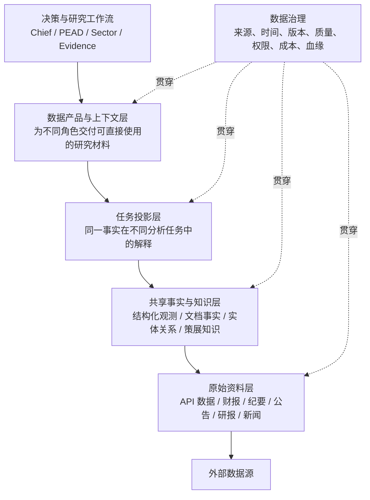

# 投资研究数据平台需求与架构设计

> 版本：0.4（统一数据层命名空间首期落地，2026-08-26）
> 定位：产品需求与逻辑架构文档  
> 读者：系统设计者、Agent / Workflow 开发者、数据源接入者

---

## 1. 文档摘要

### 1.0 按角色阅读

本文负责说明产品边界、设计哲学和总体演进。落地细节按角色拆分。统一数据目录入口是 [`config/data/catalog.yaml`](../config/data/catalog.yaml)；结构化旧配置 [`config/data/structured.yaml`](../config/data/structured.yaml)、证据源和新闻源配置在兼容期内由 catalog overlay 加载。

| 读者 | 首选文档 | 主要回答 |
|---|---|---|
| 开发者 | [结构化数据开发者指南](STRUCTURED_DATA_DEVELOPER.md) | 组件架构、领域模型、数据流、适配器契约、扩展和测试 |
| 运维者 | [结构化数据运维指南](STRUCTURED_DATA_OPERATIONS.md) | 来源覆盖、认证与预算、调度、质量门、故障、回滚和验收 |
| 使用者 / Agent 作者 | [结构化数据使用手册](STRUCTURED_DATA_USER_GUIDE.md) | 如何发现、查询、计算、追溯并组合 persistent/runtime 数据 |

可执行入口：

- 运维新增来源、评测与发布：见 [接入—评测—发布 Runbook](STRUCTURED_DATA_OPERATIONS.md#43-从新增来源到发布可执行-runbook)。
- 当前实际可用数据：运行 `ats data catalog --format markdown`，再用 `data describe`、`data availability` 和 `data examples`；不要从静态文档推断数据库覆盖。
- 自主 Agent：使用 [`.agents/skills/structured-data-consumer/SKILL.md`](../.agents/skills/structured-data-consumer/SKILL.md)；确定性 Workflow 继续调用 DataProducts，不依赖 Skill。

### 1.0.1 统一数据层代码树（当前入口）

结构化和非结构化数据不再被视为两个独立平台，而是同一数据层下的两个领域：

```text
Agent / Workflow
      ↓
ats.data.products / ats.data.runtime
      ↓
ats.data.pipelines
      ↓
ats.data.adapters + ats.data.stores
      ↓
Provider / filesystem / SQLite
```

```text
src/ats/data/
├── core/                 # 实体、来源、血缘、质量、采集运行契约
├── catalog/              # 统一 catalog loader；含结构化兼容目录
├── adapters/structured/  # 数值 Provider 入口
├── adapters/unstructured/# SEC、release、transcript、RSS、研报、新闻入口
├── pipelines/            # 采集、清洗、准入、标准化、发布
├── stores/               # structured/unstructured repository 与 artifact
├── products/             # Agent/Workflow 查询产品
├── runtime/              # 即时行情和期权，不进入持久层
```

`ats.data.structured` 和 `ats.data.products` 是当前公开的数据层入口；`memory.store` 只保存 Workflow 状态。历史迁移与验收快照由 Git 历史保存，不作为运行手册的一部分。

本次重构的目的，不是简单地把数据分成“结构化数据库”和“向量数据库”，而是把当前由各个 Agent 自行取数、加工、保存的模式，升级为一套共享的研究数据基础设施。

系统最终需要做到：

> 同一份数据只采集一次，作为共同事实保存；不同 Agent 可以基于自身职责，对这些事实形成不同解释；所有结论都可以回到当时可见的原始证据。

整个数据平台围绕五类对象组织：

1. **原始资料**：外部世界原本发布了什么。
2. **结构化事实**：可以计算、比较和回测的数据。
3. **证据事实**：从文档中识别出的可核验陈述。
4. **任务视图**：不同 Agent 如何使用这些事实。
5. **决策记录**：系统最终形成了什么分析、判断和交易决策。

这五类对象生命周期不同，因此不能全部塞进同一个数据库，也不能让某个 Agent 的输出反过来成为全系统的“事实”。

### 1.1 当前实施状态（2026-08-26）

本轮已经交付支撑该架构的首期平台能力，同时保留原有表和 Workflow 作为兼容接口：

- 原文以“逻辑文档 + 不可变内容版本”保存，并建立可定位到字符区间的文本分块。
- 财报新闻稿、SEC 公告、投资者材料、电话会纪要、普通新闻和第三方研报均通过同一个文档入口落地。
- PEAD 与 Evidence 共用经过报告期和正文质量校验的纪要；SemiAnalysis 等订阅内容不再由多个 Workflow 分别连接 IMAP / RSS。
- 普通新闻先保存 Provider 可见的标题/摘要，高价值正文抓取后升级同一逻辑文档；相同 URL 跨 Finnhub/RSS、跨公司只保存一次。
- 每个文档版本按消费者和处理器版本记录处理状态，数据源不可达、加工失败与零结果不再混为一谈。
- 台湾/韩国出口、官方财务、defeatbeta `stock_statement`、市场 Consensus 和已核验证据数值已接入统一 artifact、准入、vintage 与 `as_of` 查询；同比、环比等派生值不写入原始层。
- 财务专项暴露了官方时效、外国发行人覆盖和跨源口径差异。TSM 的 Q1/Q2 FY2026 官方 SEC 6-K/EX-99.1 同时保存普通股 `TWD/share` 与直接披露的 ADR EPS `USD/ADR`，PEAD 优先后者；镜像的拆股调整 EPS 独立为 market-adjusted 系列。SEC 的 `LongTermDebt` 单列，只有 `DebtLongtermAndShorttermCombinedAmount` 映射为官方总债务；Provider `total_debt` 单列为 provider-reported。上述语义已在隔离库和主库完成带备份的历史重分类：AMZN、MSFT、KLAC、TSM 最新覆盖均到 2026-06-30，旧的 22 个范围内假冲突已清除。主库仍有 MRVL 的 6 个独立跨源差异，已显式保留且不作为本财务语义修复的通过证据。PEAD fundamentals 仍处于 shadow 双读，尚未切 platform。达到质量门的 PEAD / Sector Consensus 与 Chain 区域序列已切 platform，并保留独立回滚开关。
- Evidence 中性事实与命题解释已经拆分；PEAD、Sector 的任务投影、命题判断与 Chain/Chief
  运行结果属于 workflow memory，不作为跨 Workflow 的数据层输入源。
- 新增稳定的数据产品接口和 `ats data` 运维入口，覆盖指标、全文检索、公司包、命题包、健康状态和血缘。
- 新增统一来源注册/隔离采集/发布门/回滚闭环，以及由实际数据库动态生成的 `catalog / describe / availability / examples`；发布运行状态写入可审计 release overlay。
- 旧库启动时自动进行加法迁移；旧表继续保留并双写，现有 Workflow 无需一次性切换。
- 已新增统一 `ats.data` 命名空间、跨结构化/非结构化 core contracts、repository ownership 和架构依赖测试。
- 已新增 `config/data/catalog.yaml`、结构化/非结构化分域配置、调度说明和 Provider 模板；`ats data config` 只读校验当前配置。
- 数据读取和写入统一走 platform；发布记录只反映来源质量门，不再维护消费者切换或 staged reconciliation。

首期有意保留以下边界：

- ticker 股价、OHLCV、订单簿、期权链、Greeks 和 IV 被明确归类为 runtime/excluded，不迁移、不回填，也不写 structured artifact；其实现归属 `ats.data.runtime.market_data` 与 `ats.data.runtime.options`，旧 `ats.data.market_data` / `ats.data.options` 仅为兼容模块别名。
- 持久来源按保留策略保存完整响应或可复现查询切片；受来源条款约束的页面只保存必要内容和血缘。
- 普通新闻遵循分级采集：全部保存标题/摘要，只有达到正文增强阈值的新闻保存全文；这是成本策略，不是数据旁路。
- 全文检索为本地确定性文本检索，尚未引入向量索引；知识图谱和图数据库仍按真实查询瓶颈决定是否建设。
- 公司研究包和数据健康视图是 V1 API / CLI 产品，不等同于完整图形化研究工作台。

---

## 2. 背景与问题

当前系统已经具备大量可用能力：

- 行情、财务、宏观、期权等结构化数据源。
- 财报、电话会纪要、公告、新闻和研报等文档源。
- PEAD、Evidence Observer、Sector Analyst 等不同分析流程。
- `evidence_observations`、`research_insights`、知识库和 dossier 等不同形式的中间结果。

但这些能力主要围绕具体 Workflow 逐步形成，数据层还没有成为独立的平台能力。

由此产生四类问题。

### 2.1 数据由使用者拥有，而不是由系统拥有

某个 Workflow 需要数据时自行抓取、加工和保存。结果是：

- 同一来源可能被多个 Workflow 重复读取。
- 数据是否已经存在，取决于某个 Agent 是否曾经运行。
- 新增 Agent 时，往往需要重新实现一套数据获取逻辑。
- 数据源故障和 Agent 分析失败混在一起。

目标状态应当是：

> 数据源由数据平台统一管理；Agent 只是数据产品的消费者。

### 2.2 原始事实与任务判断混在一起

例如一篇 SemiAnalysis 文章可能同时产生：

- 对 AMD 的负面影响判断。
- 对 HBM 需求的二阶影响。
- 对某条产业命题的证据。
- 对客户结构变化的观察。

这些结论都源自同一篇文章，但不属于同一个层次。

“Meta 要求定制某款芯片”是事实；“这对 AMD 利空”是 PEAD 的判断；“这反驳某条命题”是 Evidence Workflow 的判断。

如果把三者混成一个 Insight：

- 其他 Agent 很难复用。
- 判断容易被误当成事实。
- Prompt 或模型变化后，旧结果无法清晰重算。
- 一个 Agent 的关注范围会限制其他 Agent 能看到什么。

### 2.3 结构化数据缺少历史时点真实性

当前大量结构化数据运行时现取，只保留最后的分析结果。

这适合快速启动，但不能支持长期需要：

- 无法稳定复现某次分析。
- 上游数据修订后，不知道当时看到的版本。
- 无法严格回答“截至某一天，当时系统知道什么”。
- 历史回测容易无意中使用后来发布或修订的数据。

因此，结构化数据不仅要保存“数值”，还要保存它被发布、被系统获取和被修订的过程。

### 2.4 存储技术容易反过来主导设计

知识图谱、向量数据库、时序数据库都可能有价值，但它们只是技术手段。

如果先决定“我要一个向量库”，很容易把原始资料、事实、知识、Agent 观点和历史结论全部切片后放进去，最终得到一个能搜索但难以审计的系统。

因此，本方案先定义信息的性质和使用方式，再决定使用何种存储和索引。

---

## 3. 产品愿景

数据平台的长期定位是：

> 系统中唯一负责“获取、保存、组织和交付研究事实”的基础设施。

它不负责决定买卖，也不负责统一所有 Agent 的观点。

当任何 Agent 给出结论时，系统应能回答四个问题：

1. 结论依赖了哪些数据和文档？
2. 这些数据在当时是否已经发布？
3. 哪些部分是外部事实，哪些部分是模型解释？
4. 如果更换模型、Prompt 或分析框架，哪些内容需要重算？

这四个问题是本次架构设计的北极星。

---

## 4. 设计哲学

### 4.1 一次采集，多次解释

第三方研报、新闻、公告和财报只采集一次。

正文清洗、版本管理、基础切分和实体归一属于共享能力。PEAD、Evidence Observer 等分别形成自己的解释。

**共享的是证据，不是结论。**

### 4.2 事实与观点分离

系统必须区分：

- 外部来源明确陈述的事实。
- 数据平台做的标准化处理。
- Agent 对事实的解释。
- 多项解释汇总形成的最终结论。

越靠近原始来源的内容，越稳定、越适合共享；越靠近投资判断的内容，越需要按 Agent 隔离和版本化。

### 4.3 先无损保存，再智能加工

原始内容一旦丢失，后续无法补救；智能加工失败则可以重跑。

因此数据进入系统后的第一责任是完整保存和去重，而不是立即产生 Insight。

对于高价值来源，应采用：

> 广泛保存，选择性加工，按需深度推理。

即使当下没有 Agent 使用某篇文章，也不代表未来不会使用。

### 4.4 保留“当时的事实”

投资研究不仅关心现在最新的数字，还关心某个历史时点能够看到什么。

平台必须支持：

- 当前最新视图。
- 截至历史时点的视图。
- 数据修订前后的版本比较。
- 使用当时可见数据重放一次分析。

### 4.5 数据产品优先于数据库

Agent 不应该关心数据存在哪个文件或哪张表。

它只应该请求：

- 某个指标的历史序列。
- 某家公司最近的事实变化。
- 某条命题的证据包。
- 某只股票的研报上下文。
- 某个行业当前的数据覆盖缺口。

底层可以逐步从本地数据库迁移到更强的基础设施，但上层数据产品接口保持稳定。

### 4.6 渐进复杂，而不是一步到位

当前系统规模不需要立即建设企业级湖仓、图数据库和分布式向量服务。

只有当明确的问题出现时，才增加相应技术：

- 全文检索不足，再加向量检索。
- 多跳关系查询成为瓶颈，再考虑图数据库。
- 多进程并发写入成为问题，再迁移 PostgreSQL。
- 数据量和查询量显著增长，再拆分服务。

---

## 5. 系统边界

### 5.1 数据平台负责

- 数据源注册和接入。
- 抓取、去重、版本管理。
- 原始资料保存。
- 结构化数据标准化。
- 文档解析、切分和实体归一。
- 事实与原文之间的追溯关系。
- 数据质量、新鲜度和覆盖率。
- 向 Agent 提供稳定的数据产品。
- 管理任务投影的版本和重算。

### 5.2 Agent 和 Workflow 负责

- 决定哪些事实与当前任务相关。
- 对事实进行语义解释。
- 形成命题判断、投资影响和行业结论。
- 决定上下文如何组合。
- 在自身职责范围内更新分析状态。

### 5.3 数据平台不负责

- 自动决定买卖。
- 把所有 Agent 的观点合并成一个统一观点。
- 自动将模型发现写入永久知识库。
- 用向量相似度替代证据链。
- 用单一通用本体描述所有未来研究问题。

---

## 6. 自顶向下的目标架构



这套架构从上到下回答五个问题：

1. 谁要使用数据？
2. 它需要什么形式的数据产品？
3. 它对共同事实做了什么任务解释？
4. 系统掌握了哪些事实和知识？
5. 这些事实最初来自哪里？

下面逐层说明产品需求。

---

## 7. 第一层：决策与研究工作流

这一层是数据价值的最终使用场景，包括：

- PEAD 财报分析。
- 日常基本面监控。
- Evidence Observer 命题分析。
- 行业结构和横向比较。
- 宏观与技术分析。
- Chief 组合决策。

本层不直接访问数据源，也不自行决定如何抓取和缓存数据。

每个 Workflow 只声明三件事：

1. 自己关注哪些实体、主题或命题。
2. 希望收到哪类数据产品。
3. 对数据新鲜度、覆盖率和成本有什么要求。

例如：

- PEAD 需要“对当前持仓和信号链的影响”。
- Evidence Observer 需要“能支持或反驳特定命题的可核验事实”。
- Sector Analyst 需要“同层公司可比较的结构化数据和证据读数”。
- Chief 只需要经过治理的结论，不需要阅读全文。

---

## 8. 第二层：数据产品与上下文层

数据平台不向 Agent 倾倒全部数据，而是交付面向任务的数据产品。

建议首批建设以下数据产品。

### 8.1 指标时间序列

面向结构化分析，提供：

- 单指标历史趋势。
- 多实体横向比较。
- 指标变化、同比、环比和异常。
- 截至历史时点的数据视图。
- 数据来源和新鲜度说明。

用于财务分析、模型价格趋势、AI 渗透率、行业景气和图表展示。

### 8.2 公司研究包

围绕某个经济实体，汇总：

- 最新结构化数据。
- 近期公司披露。
- 第三方研报和新闻。
- 已识别的关键事实。
- 现存争议和证据缺口。
- 上一次分析以来发生的变化。

它不是一份固定报告，而是供 Agent 使用的上下文产品。

### 8.3 命题证据包

围绕一条可证伪命题，提供：

- 支持证据和反驳证据。
- 不同证人立场。
- 尚未发声的关键证人。
- 原文引用。
- 证据时间和有效期。
- 当前结论及结论依据。

### 8.4 行业横截面

围绕产业链层级或主题，提供：

- 各公司的可比结构化数据。
- 共同需求与相对份额分开呈现。
- 重要关系变化。
- 本期新增证据。
- 数据缺失和不可比项。

### 8.5 数据健康报告

面向系统维护者，回答：

- 哪些数据源正常。
- 哪些数据源不可达。
- 哪些来源可访问但没有新内容。
- 哪些页面结构发生变化。
- 哪些数据已经过期。
- 哪些 Agent 使用了陈旧或覆盖不足的数据。

---

## 9. 第三层：任务投影

任务投影是整个设计中最重要的隔离层。

一份共同事实进入不同 Workflow 后，可以形成不同解释。这些解释应并列存在，而不是互相覆盖。

### 9.1 PEAD 投影

回答：

- 这件事影响哪些股票？
- 是直接影响还是二阶传导？
- 影响当前论点的哪个部分？
- 是新增信息，还是已经被市场预期？
- 是否值得进入日常监控上下文？

### 9.2 Evidence 投影

回答：

- 这条事实属于哪个命题维度？
- 它支持、反驳还是不影响命题？
- 谁是陈述者，事实描述的是谁？
- 它是否构成独立证据？
- 证据是否仍在命题有效期内？

### 9.3 Sector 投影

回答：

- 这条事实影响共同需求还是相对竞争位置？
- 哪家公司正在改善或恶化？
- 是否具备横向可比性？
- 是否应该改变行业层或个股结构判断？

### 9.4 投影的产品要求

所有任务投影必须：

- 明确属于哪个任务。
- 保留生成时使用的模型和分析规则版本。
- 记录依赖了哪些共同事实。
- 可以在不重新抓取数据的情况下重算。
- 不得反向修改共同事实。
- 不得自动成为永久知识。

---

## 10. 第四层：共享事实与知识

这一层是多个 Agent 真正共享的部分，但它内部仍需区分四种信息。

### 10.1 结构化观测

包括：

- 行情。
- 财务数据。
- 宏观指标。
- 模型定价。
- 行业渗透率。
- 市场规模。
- 产能、价格和出货量。

它们本质上是带时间、来源和口径的观测。

平台不强求所有来源给出相同答案。不同供应商的数据可以同时存在，上层通过统一视图选择主源或进行交叉验证。

### 10.2 文档事实

从非结构化资料中提取的、能够回到原文核查的事实。

文档事实应尽量保持中性。例如：

- 公司宣布扩大某项产能。
- 客户要求修改某款产品配置。
- 管理层将某项收入指引上调。
- 第三方机构观察到价格上涨。

“因此某只股票应当买入”不属于文档事实。

### 10.3 实体与关系

实体是连接结构化与非结构化数据的共同坐标。

系统需要统一识别：

- 公司。
- 股票和其他证券。
- 产品。
- 技术。
- 产业链环节。
- 监管机构和数据发布者。
- 第三方研究机构。

关系分为：

- **稳定关系**：产业层级、一般性上下游结构。
- **动态关系**：具体客户、供应协议、产品认证和份额变化。
- **推断关系**：模型基于证据形成、尚未人工确认的关系。

稳定关系可以人工策展；动态和推断关系必须保留时间与证据。

### 10.4 策展知识

知识库保存长期有效的框架和判据，例如：

- 产业链如何分工。
- 哪些指标代表定价权。
- 技术替代的基本机制。
- 某类行业常见的误判。

知识库不保存：

- 当前谁排名第一。
- 本季度谁在赢。
- 当前估值高低。
- 尚未确认的模型推断。

这与现有“知识库给判据，不给排序”的原则一致，应继续保留。

---

## 11. 第五层：原始资料

原始资料层保存系统实际获取到的外部内容。

它的首要目标不是方便 Agent 阅读，而是保证：

- 内容不会丢失。
- 来源可识别。
- 重复内容不会重复处理。
- 来源修订不会覆盖历史。
- 解析器或模型升级后可以重新加工。
- 付费墙、模板变化和抓取失败可以被发现。

结构化与非结构化数据在这里采用两条不同生产线。

### 11.1 结构化生产线

```text
外部 API
→ 保存原始响应
→ 标准化口径
→ 质量检查
→ 发布结构化观测
→ 生成计算视图和图表数据
```

原则是先保存原始响应，再进行单位换算、实体映射和派生计算。

### 11.2 非结构化生产线

```text
网页 / 邮件 / PDF
→ 保存原始内容
→ 提取正文
→ 识别文档版本
→ 切分和实体识别
→ 提取可核验事实
→ 生成任务投影
```

同一文档的抓取、正文清洗和基础加工不因 Agent 数量增加而重复。

---

## 12. 第三方研报和新闻的共享机制

TrendForce、SemiAnalysis 等来源采用“一个来源资产，多个消费订阅”的产品模型。

### 12.1 共享边界

| 环节 | 是否共享 |
|---|---|
| 获取邮件或网页 | 共享 |
| 保存原始正文 | 共享 |
| 去重和版本识别 | 共享 |
| 文档切分 | 共享 |
| 实体识别 | 共享 |
| 明确、可核验的事实抽取 | 原则上共享 |
| 对股票的投资影响 | 不共享 |
| 对命题的支持或反驳 | 不共享 |
| 最终行业或交易结论 | 不共享 |

### 12.2 处理策略

平台对内容采用分级处理：

1. **保存级**：所有批准接入的内容先保存。
2. **基础级**：低成本完成正文解析、分类和实体识别。
3. **事实级**：对相关度较高的内容提取可核验事实。
4. **投影级**：根据 Agent 订阅和当前任务进行专项推理。
5. **综合级**：由 Agent 将多条投影汇总为报告或决策。

这样既避免高价值原文遗漏，也不会让每篇文章都触发所有昂贵模型任务。

### 12.3 新 Agent 的接入方式

新增 Agent 时，原则上不新增数据抓取器。

它只需要：

- 声明需要哪些数据产品。
- 定义自己的任务投影。
- 定义触发方式和成本预算。
- 定义输出如何过期或更新。

只有当它需要一种平台从未接入的数据源时，才扩展采集层。

---

## 13. 知识图谱与向量数据库的定位

### 13.1 知识图谱

知识图谱是一种关系查询能力，不是整个知识系统。

第一阶段，实体和关系可以先通过普通关系数据表达。只要能够回答：

- 某公司属于哪个产业层。
- 谁是其客户、供应商或竞争者。
- 某条关系在什么时间有效。
- 该关系依据什么证据。

就已经满足核心需要。

只有当多跳关系探索成为高频、关键场景时，再引入专门图数据库。

### 13.2 向量数据库

向量数据库用于寻找语义相关的文档段落，不承担事实真源职责。

它适合解决：

- 这篇新研报与哪些历史研报相似？
- 哪些电话会段落讨论了类似的产能问题？
- 是否存在措辞不同但语义相近的历史案例？

检索结果必须返回原文及来源，不能只返回模型摘要。

结构化数字、证据结论、交易决策和实体关系仍应保存在可精确查询的系统中。

---

## 14. 横向数据治理

数据治理不是独立的后台功能，而是贯穿所有层级的系统能力。

### 14.1 来源治理

系统应知道：

- 数据来自哪里。
- 是第一方披露、监管数据、研究机构还是媒体。
- 是否付费。
- 是否允许长期保存。
- 可靠性和优先级如何。
- 来源不可用时是否有替代方案。

### 14.2 时间治理

系统必须区分：

- 事实发生时间。
- 数据覆盖期间。
- 对外发布时间。
- 系统获取时间。
- 后续修订时间。

这是回测和复盘正确性的基础。

### 14.3 质量治理

系统必须区分：

- 成功获取且有新数据。
- 成功获取但没有新数据。
- 数据源不可达。
- 页面存在但正文无法读取。
- 内容读取成功但没有相关事实。
- 模型加工失败。

这些状态对使用者的含义完全不同，不能统一表现为“空结果”。

### 14.4 血缘治理

任何派生结果都必须能够沿着以下路径回溯：

```text
Agent 结论
→ 任务投影
→ 共同事实
→ 文档段落或结构化观测
→ 原始来源版本
```

### 14.5 成本治理

系统需要记录：

- 哪些内容触发了模型处理。
- 哪个 Agent 触发。
- 是否命中已有结果。
- 是否因模型或 Prompt 升级而重算。
- 哪些高成本任务实际没有产生有效信息。

成本控制应通过分级加工和复用实现，而不是通过丢弃原始内容实现。

---

## 15. 与现有系统的关系

本次重构不应推翻现有分析和交易链路。

现有能力可以映射到新架构：

| 现有能力 | 新架构定位 |
|---|---|
| `ats.sqlite` | 决策记忆与 Workflow 状态 |
| `source_cache` + `document_versions` | 原始资料与不可变内容版本 |
| `document_entities` | 一个文档与多个相关经济实体的发现关系 |
| `document_chunks` | 可定位的全文检索索引 |
| `document_processing_runs` | 各消费者的加工版本、结果和失败状态 |
| `research_articles` | 兼容文档目录；正文由共享文档资产保存 |
| `research_insights` + `task_projections` | PEAD 兼容结果与版本化任务投影；属于 workflow memory，不是数据层输入 |
| `evidence_observations` | Evidence 兼容表，迁移期继续双写 |
| `evidence_facts` + `evidence_fact_projections` | 中性事实与 Evidence 任务解释 |
| `measurement_series` + `measurement_points` | 结构化原始观测及修订版本 |
| `knowledge/*.md` | 人工策展知识 |
| `pead_dossier` | PEAD 的领域状态与分析结果 |
| `claim_assessments` | Evidence Workflow 的领域结论；属于 workflow memory，不是数据层输入 |

迁移过程中应维持现有 Workflow 正常运行，通过兼容视图逐步切换，不要求一次性重写所有调用方。

---

## 16. 分阶段建设路线

当前里程碑状态：阶段一的主要非结构化来源已完成统一迁移；阶段二已完成平台底座、首批数据源、运维质量面、消费者回归与最终验收；阶段三已完成兼容拆分；阶段四已有 V1 查询能力。行情与期权属于 runtime/excluded，而不是阶段二迁移缺口。财务等未通过质量门的消费者继续 legacy，详见最终验收报告。

### 阶段一：统一文档资产

**目标：同一文档只进入系统一次。**

建设：

- 统一文档入口。
- 保存原始正文和版本。
- 统一去重。
- 统一正文解析和切分。
- 让新闻、研报、公告、纪要共用文档资产。

完成标准：

- SemiAnalysis 等来源不再被多个 Workflow 独立抓取。
- 任意 Insight 都能打开对应原文。
- 解析失败与没有相关事实明确区分。

**实施状态：已完成。** 当前统一入口覆盖财报稿、SEC/手工公告、投资者材料、电话会纪要、普通新闻、Newsletter 及 Chain Article。手工文件继续拥有最高优先级；普通新闻全文仍按重要度分级获取。

### 阶段一的准入与来源策略（2026-08）

阶段一的“统一”不是把所有抓到的文本都放进知识库，而是统一执行
`候选 → 确定性校验 → accepted / quarantined`。默认查询、全文分块和 Agent
只能看到 accepted；quarantined 保留原始正文、来源和全部 reason-code，供人工修正。

文档的“业务语义”和“文件载体”分别记录。`article`、`news`、`release`、`deck`、
`transcript`、`filing` 是兼容期旧名称；新写入分别使用 `research_article`、
`news_item`、`company_release`、`investor_presentation`、`earnings_transcript`、
`regulatory_filing`。HTML、PDF、邮件、结构化数据集只是载体，不决定文档语义。

各类来源按用途排序，而不是设置一个全局“最好来源”：

| 资料 | 首选 | 回退与约束 |
|---|---|---|
| 电话会纪要 | 人工/公司官方覆盖，其次 defeatbeta 结构化纪要 | FMP 等结构化源补充；Tavily 只发现候选，必须绑定目标财报事件 |
| 公司公告 | 目标事件附近的 SEC 8-K/6-K 正式 exhibit | 公司官方 IR；没有业绩附件时禁止拿最大 HTML 充数 |
| 投资者材料 | 人工文件、登记的官方 IR 域名 | 搜索结果只作候选，需通过公司、期间和 presentation 语义校验 |
| 盘中新闻 | IBKR readonly 新闻通道 | 单标的/单时间片故障局部降级，重叠窗口按稳定 provider article id 去重 |
| 日级/历史新闻 | defeatbeta 的 Yahoo News 结构化镜像 | Finnhub/RSS 补充；规范 URL 去重，IBKR 无公开 URL 时以同标题同发布日期建立来源别名 |
| 订阅研报 | IMAP 邮件，其次公开 RSS | UIDVALIDITY + UID/Message-ID 持久游标；partial/teaser 默认不可当完整研报消费 |

Newsletter 首次运行回填配置天数，之后从成功水位重叠增量读取。只有本轮邮件全部
持久化后才推进游标；`max_articles_per_run` 只限制下游模型加工，不限制原始邮件入库。
正文完整性保留 `full / partial / teaser` 和具体截断证据。

运维查询：`ats data health` 查看来源状态和处理失败，`ats data quality` 查看覆盖率、
identity/period 正确率、正文完整率、快照延迟和统一读回一致性。来源状态明确区分
`succeeded`、`zero_matches`、`stale`、`unreachable` 与 `unauthorized`。

defeatbeta 数据集页面当前声明 ODC-BY，底层数据来自 Yahoo Finance、Nasdaq 和美国财政部，
并注明用于研究/教育。系统只保存研究所需内容与 provenance，不应把镜像重新对外分发；
上线前需按实际用途再次核查上游条款。`spec.json` 的单文件更新时间是快照时效依据，
查询成功但超过阈值仍标记 `stale`，不得静默当作最新数据。

### 阶段二：结构化数据沉淀

**目标：结构化数据可以查询、计算、回放和画图。**

建设：

- 统一结构化数据接入规范。
- 原始响应落地。
- 标准化观测。
- 支持 SQL / Pandas。
- 支持历史时点查询。
- 建立数据质量与新鲜度报告。

完成标准：

- 某次历史分析可以使用当时可见的数据重放。
- 上游数据修订不会覆盖旧版本。
- 常用指标可以直接进行跨公司和跨期比较。

**实施状态：已完成并通过最终验收。** 统一目录、artifact、中央准入、不可变 vintage、DataProducts、只读 SQL/Pandas、派生计算、快照重放以及首批五类持久数据已经实现。区域序列与 Consensus 已按消费者切换并保留回滚；财务因质量门失败保持 legacy，未覆盖来源作为后续独立 OpenSpec 输入。

### 阶段三：共享事实与任务投影分离

**目标：多 Agent 共用事实，但拥有独立解释。**

建设：

- 将中性事实从现有 Evidence 结果中拆出。
- 将 PEAD、Evidence、Sector 定义为不同投影。
- 记录模型和分析规则版本。
- 支持只重算投影，不重新抓取数据。

完成标准：

- 一条事实可以被多个 Agent 使用。
- 一个 Agent 更新 Prompt 不会覆盖其他 Agent 的结论。
- 新增命题不需要重新抓取历史文章。

### 阶段四：统一查询与检索

**目标：人和 Agent 都能方便地发现数据。**

建设：

- 指标查询。
- 全文检索。
- 公司研究包。
- 命题证据包。
- 数据健康面板。
- 根据真实效果决定是否加入向量检索。

完成标准：

- 使用者不需要知道底层数据存在哪里。
- 关键结论可以在一个界面中查看来源、证据和历史版本。
- Agent 上下文由平台构造，不再由各 Workflow 临时拼装。

---

## 17. 总体验收标准

完成本次重构后，系统应满足以下结果：

1. 同一外部内容原则上只采集和清洗一次。
2. 不同 Agent 可以对同一事实形成不同结论。
3. 任何结论都能回到具体数据或原文。
4. 结构化数据支持历史时点回放。
5. 数据源故障不会被误解为负面或中性信号。
6. 新增 Agent 不需要复制已有数据接入逻辑。
7. 模型或 Prompt 升级只重算相关投影。
8. 知识库继续保存稳定判据，不被动态观点污染。
9. 向量索引和图查询可以后加，不影响核心数据模型。
10. 现有交易与分析 Workflow 可以渐进迁移，不发生一次性大改。

最终，系统应形成三个清晰分离、又可以完整追溯的世界：

> 数据平台记录“当时外部世界发布了什么”；  
> Agent 投影记录“不同角色如何解释这些事实”；  
> 决策记忆记录“系统最终做出了什么判断和行动”。
