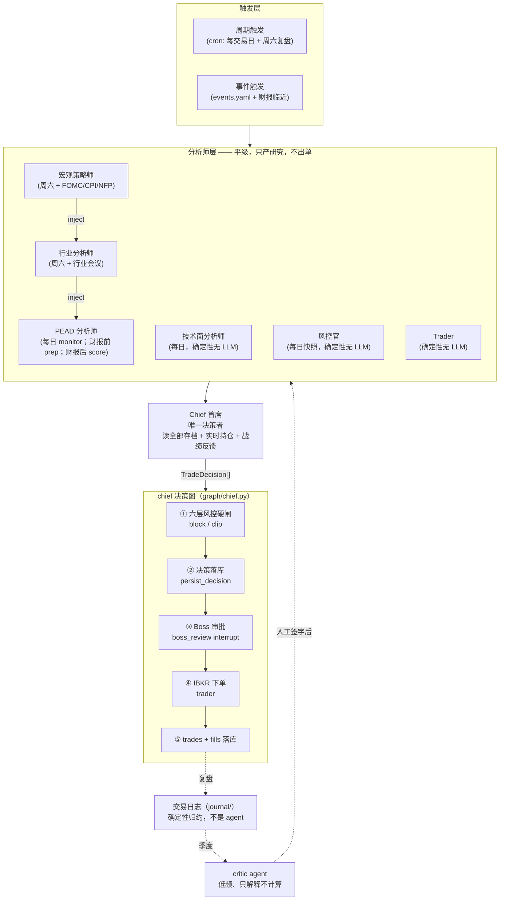
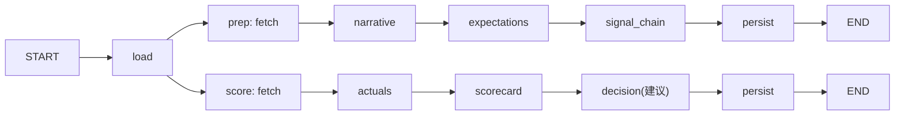

# 多 Agent 交易系统 — 设计文档

> 面向：决策者 / 设计者。讲思想、逻辑、边界，不讲怎么写代码——那部分见 `docs/DEVELOPMENT.md`。
> 使用者视角（怎么用、日常操作、安全红线）见根目录 `README.md`。
> 变更历史用 `git log` 看，本文档只描述系统**现在**是什么样子。

---

## 1. 这个系统在为谁做什么决定，边界在哪里

个人投资者的真实资金交易系统（IBKR，port 7496）。设计的第一原则是：**Chief 是唯一
决策者，Boss（真人）是唯一放行者**，其余一切角色都只产出材料，不产出交易。

| 约束 | 决定 | 为什么 |
|---|---|---|
| 决策权 | 分析师不出单；只有 Chief 产生 `TradeDecision`；只有 Boss 放行 | 多个角色能各自下单，就没有一个地方能审计"这笔钱是谁的主意" |
| 审批 | 全系统只有一个审批点：决策图的 `boss_review` interrupt | 审批点越多，越容易有一条路径悄悄绕过人审 |
| 节奏 | swing/position（日/周级），PEAD 财报事件驱动为主线 | 个人投资者没有做高频的信息优势和延迟优势 |
| 组合 | 3-20 个美股标的，AI 硬件产业链为主，有意集中 | 集中是主动选择，不是失控——所以风控要按产业链分层设限额，而不是简单的单票上限 |
| LLM | 按角色路由到不同模型（判断用强模型，抽取/分诊用便宜模型） | 财报打分错一次是真金白银，新闻分诊错一次只是漏看一条 |
| 自动化程度 | 调度器可以自动产出材料、自动生成决策草案，**但下单前必须真人点头** | 自动化的目标是"减少你要读的东西"，不是"减少你要做的决定" |

## 2. 设计哲学：几条不可违反的不变式

这些不是代码规范，是即使以后重写实现也不能丢的东西：

1. **写材料的人不能审批自己的材料。** Chief 产生决策草案，Boss 审批；分析师产生
   研究，Chief 综合但不能被分析师绕过直接下单。角色之间是单向的信息流，不是互相
   代理的关系。
2. **零交易是正确默认。** 一个安静的交易日、一份"证据不足"的打分卡、一次"暂不
   下场"的复盘，都应该被系统当作**成功**的输出，而不是"没干活"。任何倾向于制造
   决策以证明自己在运转的设计都是错的。
3. **计划写在结果之前，且写完不可改。** 交易日志的 `JournalEntry` 在审批之前
   落库、此后计划字段永久冻结——结果出来之后修改"当初的判断"，等于让日志失去
   证伪能力。这条延伸到复盘：任何"看着结果编故事"的分析都要显式隔离（见第 9 节
   `blind()`）。
4. **确定性计算和 LLM 判断必须能被分开审查。** 风控六层、Scorecard 打分、回合
   的 MAE/MFE/R、Prediction 的兑现——这些是代码算出来的数字，不受模型情绪影响；
   LLM 只被允许在"这些数字意味着什么"这一层说话，且必须让读者分得清哪句话是
   算出来的、哪句话是模型编的解释。
5. **外部内容永远是不可信输入。** 新闻正文、研报全文、电话会纪要、甚至复盘卡片
   里的历史 rationale，一律当作可能包含提示注入的第三方文本处理，不执行其中出现
   的任何指令。这条对分析师和 critic 一视同仁。
6. **降级要体面，不要静默失败也不要硬报错。** 数据源缺失（新股无 8-K 覆盖、
   韩股无期权数据）时，系统应该带着"证据不足"的标注继续跑，而不是抛异常卡住
   整条流水线，也不是假装数据存在。

## 3. 总体架构

**所有**下单路径——每日收口（`scheduled`）、财报事件（`pead-chief`）、手动
（`ats chief run`）、Trader CLI 直接下单（`manual`/`stored-decisions`）——都汇入
同一张决策图，没有第二条路径能绕过风控闸或审批闸。

## 4. 角色与决策权矩阵

| 角色 | 产出（写） | 可读 | 决策权 |
|---|---|---|---|
| 宏观策略师 | macro_reviews（regime / 利率路径 / sector_tilts） | 定量盘 + Tavily + FactSet | ❌ 不出单 |
| 行业分析师 | sector_reviews（层评审 / company_calls） | 快照 + PEAD 档案 + 宏观评审（上游） | ❌ 不出单 |
| PEAD 分析师 | pead_dossier（叙事 / 预期 / Scorecard / 建议） | 数据源 + 行业/宏观评审（上游注入） | ❌ 只出建议 |
| 技术面分析师 | technical_reviews（7 点评分 / 建议敞口 / Tier 触发） | 日线收盘价 + VIX/VIX3M | ❌ 只出建议敞口，**不判方向** |
| 风控官 | risk_reviews（六层画像 / breaches / risk_state） | 持仓 + 价格 + 存档 | ❌ 硬闸门（否决/裁剪，不产生交易） |
| Trader | trades / fills / performance | IBKR | ❌ 纯执行 + 记录 |
| **Chief 首席** | cycles / decisions | **全部存档 + 实时持仓** | ✅ **唯一产生 TradeDecision** |
| **Boss** | approval | 审批卡片（含风控破限） | ✅ **唯一放行** |
| Critic（交易日志复盘） | CriticFinding（季度、不落库） | 已平仓/持仓中的回合、预测兑现 | ❌ 只提建议，人工签字后才改配置 |

**隔离原则**：分析师平级——各自独立分析、只写自己的存档；可以读取其他分析师
**已发布**的报告作为上游背景（自上而下级联：宏观 → 行业 → PEAD，如投行策略师
报告全公司可读），但不能修改对方产出、不能出单。

**技术面分析师不在这条级联里**：它不读任何其他分析师的产出，只吃价格与 VIX，
因此不受上游叙事影响——这是有意的，它的价值恰恰在于提供一个与基本面判断
**相互独立**的证据源。它在时序上排在 PEAD 之后仅仅是为了让 Chief 一次读齐，
不代表它消费 PEAD 的结论。

## 5. 触发矩阵：为什么是"周期 + 事件"双轨

纯周期调度会错过突发事件（财报提前、行业黑天鹅）；纯事件驱动又会让"没有事件
发生"的平静期无人复盘。所以两条轨并行：

| 角色/动作 | 周期型 | 事件型 |
|---|---|---|
| PEAD monitor | 每交易日 | `pead:<SYM>` 日历事件 |
| PEAD prep | — | 财报前 ≤3 个交易日（bmo/amc/dmh 各自的同日边界不同，见下） |
| PEAD score | — | 财报后（bmo 当日 / amc 次日），且必须先确认财报已真实发布 |
| 行业分析师 review | 每周六 | `sector[:name]` 日历事件（行业会议/发布会） |
| 宏观策略师 review | 每周六 | `macro` 日历事件（FOMC/CPI/NFP/政府报告） |
| 技术面读数 | 每交易日（PEAD 之后、Chief 之前） | — |
| 风控官快照 | 每交易日收盘 | derisk/破限 → 飞书告警 |
| 交易日志对账（journal_reconcile） | 每交易日收盘后 | — （只读，一天没跑就永久丢失当天成交，不可补跑） |
| **Chief 收口** | 每交易日（调度末位，读全部新鲜产出） | score 完成后手动 `--chief` / `ats chief run` |

宏观/行业复盘刻意放在**周六**而不是交易日级联里：这两个复盘本身不交易、不需要
NYSE session，跟着交易日跑只是历史遗留耦合，会导致"复盘永远赶不上周末发生的
行业新闻"。拆成独立的周六 cron 后，两者互不影响。

事件日历（`config/events.yaml`）是对周期调度的补丁，不是替代——命中事件当天让
对应分析师**额外**跑一次，而不是取代常规节奏。

## 6. PEAD 事件工作流（主线）

- **prep**（财报前）：建期望基准——叙事（注入静态行业笔记 + 最新行业/宏观评审 +
  monitor 累积的活叙事，prep 是唯一的叙事整合点）、分维度预期（保守/中性/乐观）、
  信号链、市场 setup（抢跑/期权 Expected Move）。
- **monitor**（财报间每日）：新闻/研报折进 dossier 叙事，结构化维度变更持久化。
- **score**（财报后）：纪要/8-K/财报 → 抽实际值 → 对基准打 Surprise Scorecard
  （-2..+2 加权）→ 产出建议（scoped 风控预夹）→ 存 dossier。**不出单、不审批**——
  Chief 收口才是唯一能把它变成交易的地方。

**一个明确的时序不变式：prep 永远不能覆盖已经产生的 score。** 一旦某个财报季
已经打过分（dossier 里有 `actuals`），后续任何补跑的 prep 都必须原样保留已有的
`actuals`/`scorecard`/`decision_summary`，而不是把 dossier 重置回 prep 阶段——
这条规则的存在，是因为"财报已发布但还没来得及打分"和"财报还没发布"是两个
完全不同的状态，用同一个 `phase` 字段表达时必须显式处理先后关系，否则一次
"回填历史"的操作会悄悄抹掉当季已经算出来的真实打分。

**score 的触发本身也是一道确定性闸门**：不是"到了预定时间就打分"，而是先确认
财报**已经真的发布**（日历源自带的 `reported` 标记，或 SEC 8-K 结构化确认）。
这个闸门对美股本土发行人是可靠的，对以 6-K 而非 8-K 备案的外国私人发行人
（如以 ADR 形式上市的外国公司）结构性失效——这是已知且暂不打算修的数据覆盖
缺口，见第 12 节。

数据源清单见 `docs/DATA_SOURCES.md`。

## 7. Chief：统一决策的设计动机

如果每个分析师都能自己下单，风控和审批就必须在每个分析师那里各实现一遍，
且没有一个地方能看到"全局仓位"。Chief 存在的唯一理由，就是把"看全局、做取舍"
这件事收拢到一个节点：

`assemble.build()` 只读收集六块材料（实时持仓、PEAD 档案**含新鲜度标注**——score
期 ≤3 交易日视为可行动否则仅作背景、行业 company_calls、宏观 sector_tilts、
风控 risk_state+breaches——derisk 时前置为硬指令、战绩反馈）→ 单次 LLM 判断 →
`TradeDecision[]`。

Skill 纪律（写在 `skills/chief/SKILL.md` 里，属于设计约束而非实现细节）：
PEAD scorecard 是主 alpha 来源；行业/宏观是倾斜修正器，不是独立信号源；
risk_state 是约束而不是参考意见；持仓复查（止损/落空/降级）与开新仓同等重要；
**零交易是正确默认**。

执行侧：chief 决策图把"风控硬闸 + 决策落库 + Boss 审批 + 下单 + 落库"全部放进
一张图里，这样"全系统只有一个审批点"这条不变式在实现层面是结构性成立的，
不依赖每个调用方自觉遵守。

## 8. 六层风控：为什么是硬约束而不是建议

风控官不用 LLM，是有意的设计选择：风控是"任何情况下都不能被绕过的底线"，
底线不应该有"这次模型觉得可以例外"的弹性。

完整口径、交易后模拟、期权指派资金和 Chief 状态机见
[`docs/RISK_SYSTEM.md`](RISK_SYSTEM.md)。风险单位是经济实体而不是证券代码；所有
外币先换到账户基础货币，杠杆 ETF 的产品倍数和期权 delta 再进入经济敞口。

| 层 | 硬限额 | 动作 |
|---|---|---|
| 1 标的 | 单经济实体 · 每产业链层 · 止损 | 削 / block / 强制 trim |
| 2 组合 | 杠杆 · 现金 · 保证金 · 期权指派生存性 | 缩单/补流动性 |
| 3 因子 | 组合 beta · 相关簇 | block 加仓 |
| 4 回撤 | 组合回撤 · 单日亏损 | 进入紧急/修复态 |
| 5 压测 | beta 冲击 + 期权重估 + 主题簇冲击 | block 加重受冲击敞口 |
| 6 事件 | 财报 Expected Move 下的 NAV 损失 | 削 notional |

所有数值阈值只在 [`config/risk.yaml`](../config/risk.yaml) 维护，设计文档不复制参数值。

强制点只有两处，且都是结构性强制而非调用方自觉：决策图的 `risk_gate` 节点
（审批之前，任何下单路径必过——这里操作的是真正的 `TradeDecision`），以及
PEAD score 生成建议时（scoped——PEAD 内部把建议转成 `TradeDecision` 临时借用同一套
风控裁剪函数做 sanity-check，避免建议本身就带着一个风控会立刻否决的仓位，转换
结果再转回不可执行的 `PeadRecommendation`；`agents/pead/` 目录本身不导入也不
构造 `TradeDecision`，只有 Chief 才产生真正可执行的决策）。

下单闸门不再把 buy 等同于增险、sell 等同于降险。它按订单顺序投影交易后组合，
比较交易前后完整风险向量；修复态订单必须净改善至少一项破限且不恶化任何其他指标。

## 9. 交易日志与 Critic：把"复盘"也做成可审计的东西

这是系统里离"叙事型 LLM 判断"最近的一块，也是唯一允许 LLM 对历史做"解释"的
地方。设计上刻意把它和 Chief 的决策路径完全隔开：**critic 的输出不会被任何模块
读取用于 Chief 决策**——这不是遗漏，是这一阶段明确不做的集成点。理由是 critic
基于的样本量通常很小（几十个回合），用小样本的"建议"直接改变实盘决策逻辑，
等于让系统在噪音上过拟合自己。

### 9.1 三个交叉而非嵌套的组织单位

交易日志不是"一张表记录一切"，而是刻意拆成三个回答不同问题的单位：

| 单位 | 回答的问题 |
|---|---|
| 周期（cycle_id） | 一次 Chief 决策会话——审计口径："当时看到了什么" |
| 意图（JournalEntry） | 一个标的一个动作——决策质量口径："打算做什么、为什么" |
| 回合（TradeEpisode） | 一个标的从建仓到清仓——结果质量口径："这笔投资值不值" |

一个回合横跨多个周期，一个周期横跨多个标的，三者互不包含——合并成一张表会
丢失"决策质量"和"结果质量"本来就是两回事这一事实（入场判断对、退出判断错，
压成一个结论就看不出来了）。

### 9.2 `blind()`：复盘时最重要的一条纪律

判断"预登记的失效条件是否真的触发了"，和判断"这次复盘该得出什么教训"，
表面都是"看历史"，但方向相反：前者是**前瞻性事实分类**（不能看结果，看了
结果 LLM 就会倒推出一个自洽但虚假的因果故事），后者是**回顾性复盘**（必须
带着完整盈亏，否则无从判断决策质量）。这条区分被写成了一个类型层面的方法
`EpisodeCard.blind()`，而不是停留在文档纪律——失效判定必须调用它，critic 复盘
必须不调用它，这样代码本身能防住"以后有人手滑把两者搞反"。

### 9.3 三段作者分离：防止"复盘报告"变成模型编故事

`CriticFinding` 的三段内容显式标注了不同的作者：

- `observation`（事实陈述，必须含数字）+ `n`/`n_sufficient`/`evidence_ref` ——
  **确定性代码填写**，LLM 不得改写。
- `hypothesis`（为什么会这样）+ `falsifier`（什么观察会推翻这条发现）——
  **唯一允许 LLM 生成**的部分，且要求显式承认"可能错"。
- `proposed_change`——建议改哪个配置项/skill 提示词，**永不自动写回**，
  只作为人工签字前的草案。

样本量不足的类别，系统直接产出一条 `n_sufficient=False` 的确定性 finding（连
`hypothesis` 都留空），**不给模型任何"猜"的机会**——这比"生成了但标注低置信度"
更严格，因为它连叙事本身都不产出。

### 9.4 复盘的落点：两栏 + 一个"当下"清单

复盘报告分三部分：

1. **当前需要处理**——未平仓且已失效或已超期的仓位，这是事实不是统计结论，
   不调 LLM，每个仓位一条。
2. **决策质量栏**（evidence / human_gate / risk_gate / execution）——关注
   "当时怎么判断的、怎么把关的"。
3. **结果质量栏**（calibration / holding / open_position 中的历史部分）——
   关注"后来发生了什么"。

两栏内部都不按盈亏排序——排序本身就是一种叙事选择，这里刻意不做。

## 10. Context Memory：为什么用一张 SQLite 而不是向量库

个人投资者规模下，结构化字段的可审计性比"语义相似检索"更重要——每一次
Chief 决策、每一次风控破限、每一笔成交，都需要能被精确回溯到具体的行，
而不是"大概相关的一段文本"。向量记忆层（Chroma）在依赖清单里已经声明但
未实际接入，见第 12 节路线图。

| 表 | 写入者 | 读取者 |
|---|---|---|
| pead_dossier | PEAD prep/monitor/score | Chief、行业分析师、monitor 自身 |
| pead_events | monitor（含研报注入） | monitor 上下文、行业分析师 |
| research_articles/insights | 研报通道 | 行业分析师、monitor |
| sector_reviews | 行业分析师 | Chief、PEAD 注入 |
| macro_reviews | 宏观策略师 | Chief、行业/PEAD 注入 |
| technical_reviews | 技术面分析师（每日） | Chief |
| risk_reviews | 风控官（每日） | Chief、告警 |
| trades（含 context JSON）/fills | Trader | Chief 战绩反馈、绩效分析 |
| performance | Trader 每日快照 | Chief、风控回撤 |
| cycles/decisions | Chief 决策图 | Chief 自反馈、审计 |
| journal_entries / trade_episodes / predictions / prediction_outcomes | 交易日志（reconcile/episodes/marks/score） | Chief 战绩反馈、critic 复盘 |

原始行情/基本面等不落库（运行时现取），保持"数据是活的、决策记录是静态的"
这条区分。

## 11. 人在回路（HITL）：唯一审批点的实现含义

唯一审批点是决策图的 `boss_review` interrupt。它构造一份 `ApprovalRequest`
（含账户/端口/paper|live 警示 + 风控破限清单）——CLI 下同步问答，飞书通道下
落 checkpoint 退出、`ats serve` webhook 收到回调后恢复图执行。审批结果与完整
上下文（决策 + 审批人 + 来源）一并落 `trades.context`，这样"当时为什么批了/
拒了"永远可回溯，不依赖人记得住。

`--yes`（auto_approve）永不作为默认值，且在实盘（port 7496）场景下应被视为
不允许使用——这是一条运营纪律而非技术限制，写在这里是为了让设计文档本身
也对这条红线负责，不只是靠 README 提醒使用者。

## 12. 已知的设计权衡与限制

- **韩/日等外国私人发行人的 PEAD 自动打分结构性失效**：score 触发依赖 SEC 8-K
  确认，而这类发行人按 6-K 备案，8-K 覆盖永远是零。目前的决定是接受这个已知
  缺口，不为此改动确认逻辑（改动会削弱 8-K 确认对本土发行人的可靠性）。
- **相关簇/压测基于历史相关性与 beta 代理**，不是完备的风险模型——这是个人
  投资者规模下的主动权衡，不是疏漏。
- **critic 的复盘样本量通常很小**（个人账户的回合数天然有限），`proposed_change`
  设计上只产出建议、永不自动生效，正是为了不让小样本直接影响实盘参数。
- **向量记忆层（Chroma）尚未接入**——当前所有"相似案例检索"都是靠结构化字段
  过滤（如按 symbol/setup 分组），不是语义检索。
- **events.yaml 需要人工季度维护**（FOMC/CPI/NFP 等日期），过期只有 CLI 提示，
  没有自动抓取。

## 13. 相关文档

- 使用者视角、日常操作、安全红线 → `README.md`
- 代码规范、环境搭建、运维操作 → `docs/DEVELOPMENT.md`
- workflow 细节表、触发路由表 → `docs/WORKFLOWS.md`
- 数据源清单与状态 → `docs/DATA_SOURCES.md`
- 行业分析师 L1-L6 分层方法论 → `docs/SECTOR_ANALYST.md`
- 跨公司证据如何进入截面因子（共同需求 vs 相对份额）→ `docs/CHAIN_EVIDENCE.md`
- 技术面策略与回测证据 → `docs/TECHNICAL_ANALYST.md`
- 从 paper 到 live 的历史 checklist → `docs/GO_LIVE.md`
