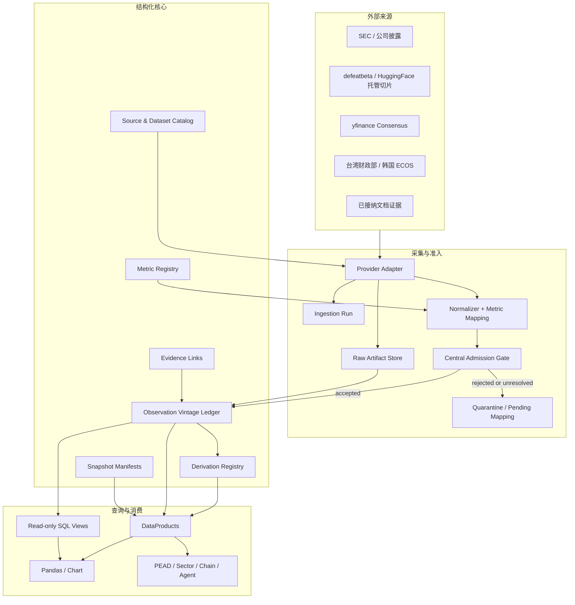
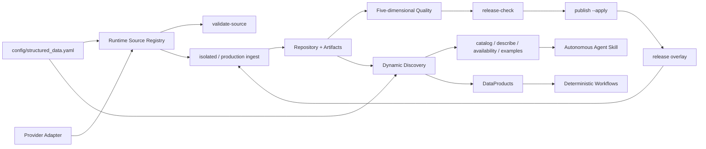
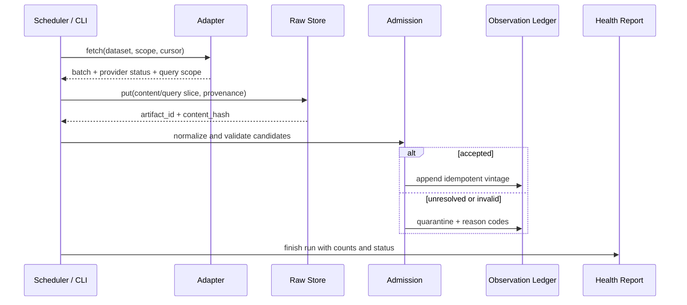
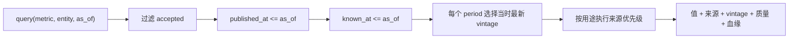

# 结构化数据层开发者指南

> 适用变更：`build-structured-data-foundation`
> 文档状态：阶段二实现基线（2026-08-25）
> 读者：数据平台开发者、Provider 适配器开发者、Agent / Workflow 开发者

## 1. 先读结论

本项目的结构化数据层不是“把所有数字放进 SQLite”，而是把低频、可复用、需要追溯和历史重放的研究事实，变成独立于 Agent 的共享数据产品。

来源、数据集、指标和消费者开关以 `config/structured_data.yaml` 为机器事实源；本文解释这些配置背后的架构约束，不建立第二套目录。

一条数值只有同时回答以下问题，才可以进入默认查询：

1. 它描述哪个经济实体？
2. 它是什么指标和口径？
3. 它覆盖哪个期间或事件？
4. 它的单位、币种和缩放是什么？
5. 它来自哪个来源版本？
6. 来源何时发布，系统何时真正获取？
7. 它通过了哪些质量检查？

高频市场输入不属于本层。ticker 股价、OHLCV、订单簿、期权链、Greeks、IV 继续由 IBKR、yfinance 或 ThetaData 在 Workflow 运行时查询，不建立持久副本。

## 2. 状态标记

本文用三种标记区分事实与计划：

| 标记 | 含义 |
|---|---|
| `CURRENT` | 当前分支已有实现，可以据此调用或运维 |
| `TARGET` | `build-structured-data-foundation` 变更内要实现，接口在完成前可能调整 |
| `DEFERRED` | 明确不在本变更实现，后续另立 OpenSpec 变更 |

当前能力基线：

| 能力 | 状态 | 说明 |
|---|---|---|
| SQLite `measurement_series` / `measurement_points` | `CURRENT` | 保存不可变数值版本，支持基础 `as_of` |
| `DataProducts.indicator_series()` | `CURRENT` | 支持筛选、vintage 和 DataFrame 输出 |
| 台湾财政部、韩国 ECOS、TrendForce 序列 | `CURRENT_PARTIAL` | 已接入统一采集、artifact、准入与查询；消费者仍按开关渐进迁移 |
| 财务与 Consensus 持久化 | `CURRENT_PARTIAL` | 已完成真实隔离验收；财务因时效/覆盖差异保持 legacy，Consensus 按消费者切至 platform |
| 指标注册、原始 artifact、隔离候选、来源选择 | `CURRENT` | 已实现统一目录、不可变 artifact、中央准入与主源/回退解释 |
| 受治理只读 SQL、横截面、snapshot manifest | `CURRENT` | 与 DataProducts 共用 accepted/as-of 语义 |
| 结构化运维 CLI 与五维质量报告 | `CURRENT` | JSON/Markdown 共用机器结果，覆盖五个质量维度与 artifact 用量 |
| 来源运行注册、发布覆盖层与动态数据目录 | `CURRENT` | 统一 validate/ingest/release/publish/rollback；catalog/describe/availability/examples 从实际库生成 |
| Agent 结构化数据消费 Skill | `CURRENT` | 自主 Agent 的发现与取数规程；确定性 Workflow 不依赖 Prompt |
| PostgreSQL、湖仓、图形化数据工作台 | `DEFERRED` | 由真实规模和查询瓶颈决定 |

## 3. 设计哲学

### 3.1 可治理的观测，而不是裸数值

平台的最小事实单元是 observation，而不是 `float`。同一个 `100`，可能分别表示 100 美元、100 百万美元、100%、单季收入或年初至今累计收入。失去语义后无法安全计算，也无法跨来源对账。

### 3.2 一次采集，多次使用

Provider 接入、原始保存、映射、准入和质量判断由平台完成一次。PEAD、Sector、Chain 和未来 Workflow 从 DataProducts 获取同一批事实，不再各自下载、清洗和缓存。

### 3.3 原始事实、标准化事实、派生值分离

- Provider 原始字段和响应先不可变保存。
- 标准化观测只表达来源事实，不提前写入同比、环比或移动均值。
- 派生值由带版本的公式在查询时计算；必要时可缓存，但缓存可删除重建。
- Agent 的投资解释属于任务投影，不得回写为平台事实。

### 3.4 时间真实性优先

平台区分覆盖期、发布时间、首次获取时间和修订获取时间。`as_of` 回答的是“当时系统实际能够知道什么”，不能因来源后来给出一个更早日期，就让历史查询提前看到该值。

### 3.5 缺失是状态，不是零

以下状态语义不同，必须分别保存：

- `no_change`：成功访问，内容与上次相同。
- `zero_match`：请求成功，但查询范围没有匹配记录。
- `not_yet_published`：目标期尚未到发布时间。
- `no_coverage`：Provider 不覆盖该实体或指标。
- `stale`：有旧值，但超过用途的新鲜度门槛。
- `unreachable`：网络或服务不可达。
- `unauthorized`：凭证、订阅或权限不足。
- `parse_failed`：响应存在但无法解析。
- `validation_failed`：已解析但未通过准入。

### 3.6 渐进替换，不同时改数据源和消费者

新平台先写入隔离库并与旧接口对账，再进行 shadow read，最后按消费者切换。旧接口在本变更中保留；删除旧逻辑必须另立变更并重新跑完整 Workflow 验收。

## 4. 系统边界

### 4.1 持久结构化数据

本变更的目标范围包括：

- 公司官方财务报表事实及其修订。
- defeatbeta `stock_statement` 的目标实体/期间切片。
- 市场 Consensus 的真实抓取快照。
- 台湾、韩国官方月度出口序列。
- 经文档证据和人工/规则核验的融资、估值、ARR 等事件数值。
- 由上述事实计算的同比、环比、滚动统计和显式汇率换算。

### 4.2 运行时市场数据

以下路径保持运行时查询，不进入 structured repository：

- IBKR 持仓、账户、成交、实时行情和 model Greeks。
- yfinance ticker 股价、OHLCV 和期权链。
- ThetaData 期权数据。
- 由即时价格计算的 momentum、expected move、IV/skew 等市场状态。

Workflow 可以组合 persistent 与 runtime 输入，但 structured snapshot manifest 只记录持久输入。若需审计某次决策使用的市场价格，应由既有决策记录或 Journal 保存该次输入结果，而不是建设行情历史副本。

### 4.3 非结构化数据的关系

文档正文继续由阶段一 document asset 系统保存。结构化层只保存 `document_id / version_id / span` 等血缘引用和经准入的数值，不复制正文。

## 5. 目标组件架构



组件职责不可相互越界：

| 组件 | 负责 | 不负责 |
|---|---|---|
| Adapter | Provider 协议、分页、原字段、响应状态 | 全局指标含义、Agent 观点、直接写业务表 |
| Raw Artifact Store | 保存本次看到的内容或可复现切片 | 选择主来源、修改原始值 |
| Normalizer | 实体/期间/单位解析和字段映射 | 猜测无法确认的语义 |
| Admission Gate | 统一校验和 reason codes | 用模型置信度代替证据 |
| Repository | 事务、幂等、vintage、血缘 | 业务展示逻辑 |
| DataProducts | 来源选择、查询、派生和稳定契约 | 暴露物理表给 Agent |
| Workflow | 组合数据、形成任务观点 | 自行复制采集和持久化逻辑 |

### 5.1 运维控制面与消费发现面



三种状态必须分开：`catalog_status` 是代码/能力成熟度；release overlay 的 source mode 是当前是否允许统一采集；consumer mode 是某个 Workflow 当前读 legacy 还是 platform。`src/ats/structured/flags.py` 按环境变量、release overlay、checked-in config、legacy 默认的顺序解析运行模式。

动态目录由 `src/ats/structured/discovery.py` 联合 YAML 和 repository 生成。YAML 回答“注册了什么”，repository 回答“现在实际可查什么”。任何 UI、Agent 或文档示例都不应再维护第二份静态指标列表。

## 6. 采集与查询数据流

### 6.1 采集数据流



一次运行的“HTTP 成功”“解析成功”“准入成功”是三件不同的事。任何局部实体、期间或来源失败都不能阻断其他切片。

### 6.2 `as_of` 查询数据流



来源不提供可靠发布时间时，`known_at` 只能取真实抓取时间，禁止回填伪历史。

## 7. 领域对象

目标模型围绕稳定身份组织，而不是复制 Provider 表结构：

| 对象 | 稳定身份和作用 |
|---|---|
| Source | Provider 身份、认证、限流和保存约束 |
| Dataset | 来源中的业务数据集、覆盖范围、更新节奏和用途 |
| Ingestion Run | 一次确定范围的采集运行及最终状态 |
| Raw Artifact / Query Slice | 实际看到的不可变内容、查询条件、哈希和获取时间 |
| Entity | 公司、证券、国家/地区、行业或私营公司的稳定标识 |
| Metric Definition | 研究含义、单位族、周期、口径和可比性约束 |
| Provider Mapping | Provider 字段/XBRL concept 到核心指标的版本化映射 |
| Series Identity | 来源、实体、指标和必要维度的稳定组合 |
| Observation Vintage | 同一期间事实的一次数值版本及可见时间 |
| Derivation Definition | 公式、版本、输入、窗口和转换要求 |
| Evidence Link | document/version/span、提取方式和核验状态 |
| Snapshot Manifest | 一次分析实际使用的持久观测和公式版本 |

逻辑身份示例：

```text
entity=AMZN
metric=financial.revenue.gaap
period=FY2026Q2
period_basis=quarter
currency=USD
unit=currency
source=sec_companyfacts
```

`source` 不属于核心指标语义，但属于来源序列和 vintage。官方值与镜像值并列保存，不覆盖、不平均。

## 8. 存储设计

### 8.1 当前与后续边界

- `CURRENT`：`var/ats.sqlite` 同时保存 Workflow 状态、文档目录和基础 measurement 表。
- `CURRENT`：structured repository 边界默认可同库部署，也可通过 `ATS_STRUCTURED_DB_PATH` 使用隔离 SQLite。
- `CURRENT`：较大的 JSON、CSV、XBRL、Parquet query slice 使用内容寻址文件保存；SQLite 保存目录、哈希、血缘和准入状态。
- `DEFERRED`：只有真实并发或扫描基准超过阈值，才迁移 PostgreSQL / Parquet / DuckDB 平台真相源。

所有数据库变更必须是加法迁移：旧库可启动、旧 measurement 可读、旧值不得被静默重写。

### 8.2 内容寻址

原始 artifact 以内容哈希去重。元数据至少要能回答：

- Provider、dataset 和查询范围。
- 请求/来源快照标识。
- fetched_at 和可用的 published_at。
- 内容哈希、字节数、媒体类型和本地路径。
- 完整保存、允许范围内切片或仅指针三种保存等级。
- 上游身份，例如 defeatbeta 数据通过 HuggingFace 托管时同时记录两层 provenance。

### 8.3 兼容旧 measurement

旧 `measurement_series` / `measurement_points` 继续可读。迁移不得猜测历史发布时间，也不得把历史 `fetched_at` 解释成 Provider 发布时间。无法安全映射的旧记录进入兼容视图或迁移审计清单。

## 9. 指标注册与映射

指标采用“核心定义 + Provider 映射 + 待映射池”：

```text
Provider field / XBRL concept
        │
        ├─ exact semantic match ──> core metric
        └─ ambiguous/unknown ─────> pending mapping + raw retained
```

首批核心指标由真实消费者决定：

- 财务：收入、毛利、营业利润、净利润、摊薄 EPS、经营现金流、资本开支、自由现金流、现金、存货等。
- 财务派生：同比、环比、毛利率、营业利润率；必须基于可比期间。
- Consensus：EPS/收入预测及区间、目标价、评级分布、评级变化、reported actual。
- 区域：台湾 IC 出口水平、韩国半导体出口指数水平。
- 证据型事件：融资金额、投后/投前估值、ARR；只有证据齐全并核验后发布。

以下维度不可合并：GAAP 与 non-GAAP、单季与累计、reported 与 consensus、币种不同且未显式换算、公司财期不同且未归一。

## 10. Adapter 契约

Adapter 返回批次，不直接写 repository。当前协议如下：

```python
class StructuredAdapter(Protocol):
    def fetch(self, request: FetchRequest) -> AdapterBatch:
        """Return provider-native records, artifacts, query scope and status."""
```

一个合格批次需要携带：

- source / dataset 身份。
- 请求实体、期间、分页或 predicate 范围。
- Provider 原生记录，不提前改成 Agent DTO。
- 原始 artifact 或受限保存声明。
- Provider 响应状态和错误分类。
- Provider 给出的发布时间、版本、币种和单位；不存在时保持缺失。
- 局部失败列表，而不是一个吞掉细节的空数组。

禁止行为：

- Adapter 内直接写 `measurement_points`。
- 把无记录和网络异常都返回 `[]`。
- 把 NaN、空值或缺失历史替换成 0。
- 在不确定时用文件名、ticker 或模型猜测实体/财期。
- 在 Adapter 内计算并永久写入 yoy/mom。

## 11. 准入规则

中央准入按以下顺序工作：

1. 来源和 dataset 是否已注册。
2. 实体是否可解析且与查询范围一致。
3. 指标是否有明确映射；未知字段进入 pending mappings。
4. 期间/事件是否明确，财期标签是否绑定到具体期间。
5. 数值是否有限且符合指标允许类型。
6. 单位、币种和缩放是否明确。
7. published_at / known_at 是否自洽。
8. 是否为完全重复、合法修订或来源冲突。
9. 数据集专用规则是否通过。

准入输出始终包含 reason codes。隔离候选仍保留 raw lineage，但默认 DataProducts 和 SQL 视图不可见。

## 12. Repository 与 DataProducts

Repository 是存储抽象，DataProducts 是消费者抽象。Agent 只能依赖后者。

`CURRENT`：

```python
from ats.data_platform import get_data_products

products = get_data_products()
rows = products.indicator_series(
    source_id="tw_ic_exports",
    entity="TW_IC_EXPORT",
    as_of=None,
    include_vintages=False,
)
```

当前稳定产品面包括：

- `metric_series`：单实体指标序列、最新或全部 vintage。
- `cross_section`：多实体同指标比较和可比性检查。
- `derive`：同比、环比、窗口统计和显式汇率换算。
- `datasets / metrics / sources`：发现与目录。
- `lineage / conflicts / pending_mappings`：治理钻取。
- `snapshot_manifest`：记录和重放一次分析使用的持久输入。
- `as_frame=True`：与对象查询相同语义的 Pandas 输出。
- read-only SQL：accepted 视图，不暴露 Workflow 内部表。

查询返回值必须携带 value、period、source、vintage/known_at、quality、selection reason 和 lineage。只返回数字的便捷方法只能是显式的上层转换。

## 13. 派生计算

派生规则必须版本化并声明输入：

```text
yoy_v1(current, same_period_previous_year)
mom_v1(current, immediately_previous_period)
rolling_mean_v1(window=N, min_periods=N)
fx_convert_v1(value, source_currency, target_currency, fx_observation)
```

规则：

- 缺历史返回 missing，不得按零计算。
- 财务同比只能比较相同口径的期间。
- 汇率换算必须显式给出汇率观测和时间，不得隐式使用“当前汇率”。
- 公式升级保留旧版本，历史 snapshot manifest 固定所用版本。

## 14. 来源选择和冲突

来源优先级按 dataset 和用途配置：

- 官方公司财务默认优先于 defeatbeta 镜像。
- 台湾/韩国出口以官方源为主。
- Consensus 保存每次真实抓取；未来付费源并列，不覆盖 yfinance 历史。
- 文档型数值按来源等级和核验状态发布。

主源陈旧或不可达时可以回退，但结果必须返回：

- 实际采用来源。
- 未采用主源的原因。
- 其他来源并列值。
- 差异和 conflict 状态。

绝不对冲突值无解释平均。

## 15. persistent 与 runtime 组合

Workflow 编排层负责组合两类输入：

```python
from ats.data import market_data, options
from ats.schemas.market import Ticker

financial = products.metric_series(
    metric="financial.revenue.gaap",
    entity="AMZN",
    dataset="company_financials",
    as_of=decision_time,
)
runtime = market_data.fetch_snapshot(Ticker(symbol="AMZN"))  # yfinance，按需查询
options_now = options.fetch("AMZN")           # ThetaData / yfinance

context = products.compose_inputs(
    persistent=financial["rows"],
    runtime=[runtime.model_dump(mode="json"), options_now],
)
manifest = products.snapshot_manifest(
    consumer="pead", purpose="earnings-analysis", as_of=decision_time,
    rows=context["snapshot_eligible"],
)
```

严禁把 `runtime` 对象传给 structured repository 的 write API。边界测试会在调用行情与期权后断言数据库和 artifact 目录没有新增行情记录。

## 16. 接入新来源的标准步骤

1. 在 `config/structured_data.yaml` 登记 source、dataset、用途、覆盖、认证、保存约束、内部请求预算、质量门和验收样本。
2. 为 Provider 原始响应建立固定 fixture，先定义成功、空响应、未发布、限流、权限不足和字段变化。
3. 实现 Adapter batch，不写业务表。
4. 在 `src/ats/structured/runtime_registry.py` 注册受控 adapter key 和工厂；YAML 不允许任意动态 import。
5. 建立实体、指标、期间、单位和币种映射；未知字段进入 pending mapping。
6. 运行 `ats data validate-source --source <id>`，增加 adapter contract tests 和中央准入测试。
7. 使用 `ats data ingest --source <id> --force --db <isolated.sqlite> --artifact-root <isolated-dir>` 跑隔离端到端与少量真实源 smoke。
8. 对隔离库运行 `catalog`、`quality`、`examples`，保存来源响应、覆盖和质量报告。
9. 以 `publish --mode shadow --apply` 开放生产旁路采集，与旧路径做 reconciliation。
10. `release-check --mode platform` 通过后再显式 `publish --apply`；consumer 另行切换并完成回滚演练。
11. 观察一个完整更新周期，再扩大范围。

运维命令、逐项通过标准和回滚流程见 [结构化数据运维指南](STRUCTURED_DATA_OPERATIONS.md#43-从新增来源到发布可执行-runbook)。

示例验收不是“HTTP 200”，而是：目标实体正确、期间正确、单位正确、重复运行幂等、修订形成新 vintage、`as_of` 无前视、局部失败可隔离、报告总数可对账。

## 17. 测试分层

| 层级 | 目的 | 是否联网 |
|---|---|---|
| 领域单元测试 | 时间、身份、哈希、映射、派生和来源选择 | 否 |
| Adapter fixture tests | 固定 Provider 响应和异常语义 | 否 |
| Repository migration tests | 空库、旧库、幂等、修订、并发读、重启 | 否 |
| Query tests | `as_of`、SQL/Pandas 一致性、可比性、快照重放 | 否 |
| 隔离集成测试 | raw → candidate → accepted/quarantined → query | 否/假来源 |
| 真实源 smoke test | 认证、接口变化、覆盖、时效和真实差异 | 是，隔离库 |
| Shadow reconciliation | 新旧消费者关键值和缺失语义对账 | 是/真实样本 |
| Workflow 回归 | PEAD、Sector、Chain 完整运行和输出差异 | 按验收方案 |

纯 mock 测试不能替代真实源 smoke 和 Workflow 回归，但真实网络测试也不能替代确定性 fixture。

## 18. 迁移与 feature flag

每个持久来源和消费者分别支持四种模式：

- `legacy`：只读旧路径。
- `shadow`：旧路径对外，新平台旁路读取并记录差异。
- `platform`：新平台对外，旧路径仍可回滚。
- `fallback`：优先新平台，质量门失败时显式回退旧路径。

股价和期权不参与这些迁移开关。切换必须按“来源 × 消费者”进行，不能用一个全局开关同时改变 PEAD、Sector 和 Chain。

## 19. 常见错误与禁止绕过

- 不要让 Agent 直接 import Provider Adapter。
- 不要让研究脚本直接向 accepted 表写值。
- 不要因 Provider 字段名相同就认定语义相同。
- 不要把 `fetched_at` 当作 `published_at`，也不要反过来。
- 不要覆盖修订前数值。
- 不要把 quarantine 或 pending mapping 暴露在默认 SQL 视图。
- 不要将第三方镜像的抓取时间当成公司披露时间。
- 不要把模型置信度当成文档型数值的发布许可。
- 不要把运行时股价和期权写入本层，即便只有日线。
- 不要在未跑真实对账和回滚演练前删除旧路径。

## 20. 相关文档

- [总体数据架构](DATA_ARCHITECTURE.md)
- [结构化数据运维指南](STRUCTURED_DATA_OPERATIONS.md)
- [结构化数据使用手册](STRUCTURED_DATA_USER_GUIDE.md)
- [数据源说明](DATA_SOURCES.md)
- [开发与测试约定](DEVELOPMENT.md)
