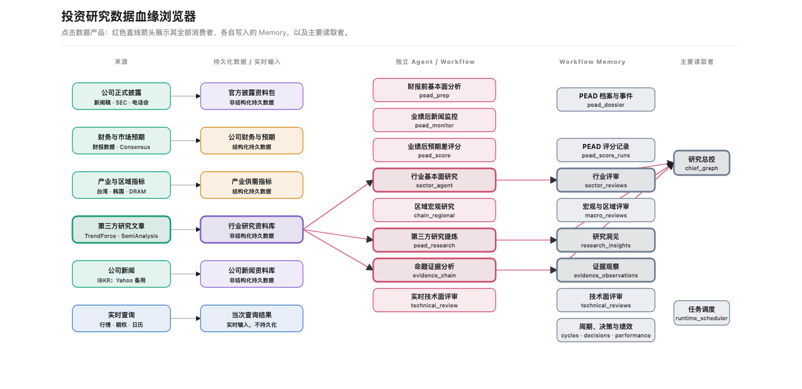

# 结构化数据层运维指南

> 读者：数据源运维者、发布负责人、故障处理者
> 适用范围：持久化结构化研究数据；不包含 IBKR/yfinance 股价和期权行情
> 当前状态：统一数据层迁移期，2026-08-26

## 1. 先回答六个最常见的运维问题

| 问题 | 答案 |
|---|---|
| 在哪里新增或修改数据源？ | 首先修改 [`config/data/catalog.yaml`](../config/data/catalog.yaml) 及对应 `config/data/structured.yaml`、`config/data/unstructured.yaml`；Provider 请求约束放在 `config/data/providers/`。兼容期的结构化详细字段仍映射到 [`config/data/structured.yaml`](../config/data/structured.yaml)。同时必须更新对应 dataset 引用、Adapter 和运行注册。 |
| 在哪里停用数据源？ | 先通过 release overlay 把 source mode 回滚到 `legacy`；不要直接删除 YAML。默认文件是 `var/structured_data/releases.yaml`。 |
| 在哪里删除数据源？ | 已产生采集历史、artifact 或 observation 的来源不做硬删除，而是停止采集并退出主源/回退源选择，保留目录项供历史血缘解析。只有从未产生持久数据且没有任何引用的来源才可删除配置和代码注册。 |
| 手动采集怎么触发？ | `ats_cli data ingest --source <source_id> ...`。首次真实源测试必须同时指定隔离 `--db` 和 `--artifact-root`，并使用 `--force`。 |
| 自动采集怎么触发？ | 当前没有内建的 structured ingestion scheduler。`ats schedule` 是交易/研究 Workflow 调度器，不会自动执行 `ats data ingest`。自动采集需由 cron、launchd 或部署平台按计划调用同一个 `data ingest` 命令。 |
| 哪个文件决定“当前是否运行”？ | checked-in 基线在 `feature_flags.sources`；临时生产覆盖在 `var/structured_data/releases.yaml`。解析优先级为环境变量 → release overlay → checked-in config → `legacy`。 |

统一配置只读校验：

```bash
ats_cli data config
```

该命令检查 catalog 版本、legacy overlay 文件、来源/dataset 引用、adapter 注册、运行状态和 runtime/excluded 边界；它不联网、不写数据库、不修改发布状态。

本手册只讲运维操作。研究者如何发现、查询和计算数据，见[结构化数据层使用手册](STRUCTURED_DATA_USER_GUIDE.md)。

## 2. 命令边界：哪些归运维，哪些归使用者

### 2.1 运维命令

这些命令负责配置检查、采集、质量验收、发布和故障处理：

| 命令 | 作用 | 外部联网 | 写数据 | 改发布状态 |
|---|---|---:|---:|---:|
| `sources` / `datasets` / `metrics` | 查看机器注册清单 | 否 | 否 | 否 |
| `validate-source` | 检查配置、数据集引用、预算和 Adapter 运行注册 | 否 | 否 | 否 |
| `ingest` | 调用 Provider，保存 ingestion run、artifact、candidate 和 observation | 是或读本地来源 | 是 | 否 |
| `health` / `coverage` / `quality` | 查看健康和五维质量门 | 否 | 否 | 否 |
| `conflicts` / `pending-mappings` | 查看冲突和未映射字段 | 否 | 否 | 否 |
| `ingestion-history` / `artifacts` | 审计运行历史和原始资产用量 | 否 | 否 | 否 |
| `financial-package-check` | 对 `company_financials` 的验收样本做原始数据、字段血缘、报告期、币种、完整性、时效与派生重算检查；不读取任何 consumer | 否 | 否 | 否 |
| `release-check` | 读取最近运行与质量门，判断能否发布 | 否 | 否 | 否 |
| `publish` | 默认预览；带 `--apply` 才写 release overlay | 否 | 仅 `--apply` 写 overlay | 仅 `--apply` |
| `releases` | 查看当前 overlay 和审计历史 | 否 | 否 | 否 |

### 2.2 使用者命令

`catalog`、`describe`、`availability`、`examples`、`series`、`derive`、`cross-section` 和 `lineage` 属于数据消费面，统一在使用手册说明。本手册仅在发布验收时引用 `catalog` 检查最终可见状态，不重复讲查询语法。`data series` 是使用者取数命令，不是采集或运维命令。

消费者统一读取已发布的 platform 数据；`financial-package-check` 和 `release-check --source` 是
数据发布流程，只检查原始 artifact/lineage、实体/报告期、单位/币种、完整性、时效、质量以及原始到派生计算的可复算性。

特别说明：`data sources` 是运维机器清单，不证明数据库中已有可查询数据；使用者应通过 `data catalog` 和 `data availability` 判断实际覆盖。

## 3. 一次性设置命令环境

以下示例默认在 Bash 或 Zsh 中运行。每个终端会话只需设置一次：

```bash
export ATS_REPO="/absolute/path/to/auto_stock_trading_agents"
export ATS_PYTHON="$ATS_REPO/.venv/bin/python"
cd "$ATS_REPO"

ats_cli() {
  PYTHONPATH="$ATS_REPO/src" "$ATS_PYTHON" -m ats.runtime.cli "$@"
}
```

后文的 `ats_cli data sources` 等价于：

```bash
PYTHONPATH=src .venv/bin/python -m ats.runtime.cli data sources
```

生产环境还应显式设置绝对路径：

```bash
export ATS_STRUCTURED_DB_PATH="/absolute/path/to/structured.sqlite"
export ATS_STRUCTURED_ARTIFACT_ROOT="/absolute/path/to/structured_artifacts"
export ATS_STRUCTURED_RELEASE_FILE="/absolute/path/to/releases.yaml"
```

未设置 `ATS_STRUCTURED_DB_PATH` 时会沿用 `ATS_DB_PATH`。未设置 artifact 根目录时使用仓库下 `var/structured_artifacts`。自动任务不能依赖不确定的工作目录。

## 4. 配置文件完整说明

统一数据层的机器配置入口是 [`config/data/catalog.yaml`](../config/data/catalog.yaml)。它索引结构化、非结构化和 runtime 配置；详细内容分别位于 `config/data/structured.yaml`、`config/data/unstructured.yaml`、`config/data/schedules.yaml` 和 `config/data/providers/`。

配置职责边界：

| 路径 | 运维职责 | 是否保存密钥 |
|---|---|---:|
| `config/data/catalog.yaml` | 数据源、数据集、领域与状态总目录 | 否 |
| `config/data/structured.yaml` | 指标、映射、结构化质量门 | 否 |
| `config/data/unstructured.yaml` | 文档类型、正文策略、准入和保留规则 | 否 |
| `config/data/providers/*.yaml` | Provider endpoint、预算、所需环境变量名 | 否 |
| `config/data/schedules.yaml` | 触发意图和预算；不直接创建 scheduler job | 否 |
| `config/pead.yaml`、`config/sectors/` | Workflow 消费者配置 | 视现有约定 |

密钥仍只能放在 `.env` 或部署环境。

### 4.1 顶层结构

| 顶层字段 | 含义 | 典型修改场景 |
|---|---|---|
| `version` | 配置格式版本；当前只能是 `1` | 配置 schema 发生不兼容变化时 |
| `feature_flags` | source 采集模式和 consumer 读取模式的 checked-in 基线 | 上线、影子运行、消费者切换 |
| `allowed_ingestion_statuses` | 合法采集终态清单 | 新增平台级运行状态时 |
| `entities` | YAML 内维护的非上市实体；上市证券主要来自外部实体注册 | 增加 OpenAI 一类无 ticker 实体 |
| `sources` | Provider 来源目录和请求约束 | 新增、修改或停止一个来源 |
| `datasets` | 业务数据集、主源/回退源、质量门和验收样本 | 增加业务覆盖或改变来源优先级 |
| `metric_definitions` | 平台统一指标语义 | 增加可查询指标或派生指标 |
| `provider_mappings` | Provider 原字段到统一 metric ID 的映射 | Provider 新字段、XBRL concept 或字段重命名 |
| `unmapped_policy` | 未确认字段的处理规则 | 通常不改；默认保留并隔离 |
| `migration_consumers` | PEAD、Sector、Chain 等消费者的数据边界 | 新增消费者或调整 persistent/runtime 分类 |

### 4.2 `feature_flags`：运行和读取不是一回事

```yaml
feature_flags:
  default_mode: legacy
  sources:
    sec_companyfacts: shadow
  consumers:
    pead_fundamentals: shadow
  consumer_sources: {}
```

| 字段 | 控制对象 | 说明 |
|---|---|---|
| `default_mode` | 未显式配置的 source/consumer | 安全默认应保持 `legacy` |
| `sources.<source_id>` | 是否允许统一 `ingest` 入口运行该来源 | `legacy` 会拒绝非强制采集；`shadow/platform/fallback` 允许采集 |
| `consumers.<consumer_id>` | 某个 Workflow 默认读旧路径还是新平台 | 与 source 采集开关相互独立 |
| `consumer_sources.<consumer_id>.<source_id>` | 针对某 consumer/source 的精细覆盖 | 仅在需要局部切换时使用 |

合法 mode：

| mode | 运维含义 |
|---|---|
| `legacy` | source 不通过统一入口生产采集；consumer 继续旧路径 |
| `shadow` | 允许新路径采集或双读对账，但不作为默认结果 |
| `platform` | 已通过发布门，作为平台路径运行或读取 |
| `fallback` | 仅在主路径不可用时作为回退 |

mode 的运行覆盖优先级：环境变量 → release overlay → checked-in config → `legacy`。环境变量只用于单进程诊断；release overlay 用于可审计的运维切换；checked-in config 用于经过代码审查的长期基线。

### 4.3 `sources.<source_id>` 字段字典

```yaml
sources:
  sec_companyfacts:
    catalog_status: current_partial
    persistence: persistent
    provider: SEC EDGAR
    adapter: sec_companyfacts
    datasets: [company_financials]
    cadence: event
    retention: full_response
    internal_request_budget:
      concurrency: 1
      requests_per_second: 5
      timeout_seconds: 30
```

| 字段 | 必填 | 含义与约束 |
|---|---:|---|
| source key | 是 | 稳定 `source_id`；入库后不要重命名，否则历史血缘会断裂 |
| `catalog_status` | 是 | 能力成熟度，不是运行开关；见下方状态表 |
| `persistence` | 是 | `persistent` 或 `runtime`；`runtime` 来源不得写 structured repository |
| `provider` | 是 | 面向人的 Provider 名称 |
| `upstream` | 否 | 托管方并非原始业务来源时记录上游，例如 defeatbeta/HuggingFace/Yahoo Finance |
| `adapter` | 是 | `runtime_registry.py` 中的稳定 adapter key，不是任意 Python import 路径 |
| `datasets` | persistent 必填 | 该来源写入的数据集；首期统一 ingest 要求恰好一个 dataset |
| `cadence` | 是 | 来源业务更新节奏元数据；它不会自动创建定时任务 |
| `retention` | 是 | `full_response`、`query_slice`、`normalized_snapshot` 等保存策略标签 |
| `internal_request_budget` | persistent 必填 | 并发、每次请求量、间隔和超时等内部保护预算；不是 Provider 官方 QPS |
| `excludes` | runtime/excluded 使用 | 明确不得持久化的数据类型 |

合法 `catalog_status`：

| 状态 | 含义 | 是否可通过统一 ingest 发布 |
|---|---|---:|
| `current` | 能力已完整接入 | 是，仍须受 source mode 控制 |
| `current_partial` | Adapter 已实现，但覆盖、消费者切换或观察期未完全完成 | 是，仍须通过质量门 |
| `planned` | 仅登记计划，尚未形成可运行 Adapter | 否 |
| `deferred` | 已知但当前不实施 | 否 |
| `runtime_excluded` | 仅运行时查询，明确禁止持久化 | 否 |

不要把 `catalog_status: current_partial` 当成“生产已启用”。启用状态由 source mode 决定，实际可查询状态由数据库覆盖决定。

### 4.4 `datasets.<dataset_id>` 字段字典

| 字段 | 含义 |
|---|---|
| dataset key | 稳定业务数据集 ID，例如 `company_financials` |
| `catalog_status` | 数据集能力成熟度 |
| `entities` | 明确列举的实体范围 |
| `entity_registry` | 实体来自其他注册文件时的路径 |
| `coverage_from` | 预期 coverage universe 来自哪些业务配置 |
| `expected_cadence` | 业务上预期更新节奏，用于新鲜度和缺口判断 |
| `primary_sources` | 默认主源，顺序有业务含义 |
| `fallback_sources` | 主源不可用时允许的回退源 |
| `core_metrics` | 发布和覆盖验收关注的核心指标，不等于全部 Provider 字段 |
| `quality` | coverage、freshness、continuity、reconciliation 等机器阈值 |
| `acceptance_samples` | 隔离真实源测试必须覆盖的代表实体 |
| `rollback_on` | 触发回滚的 reason code 或质量条件 |

双向引用必须成立：`sources.<id>.datasets` 包含 dataset，同时 dataset 的 `primary_sources` 或 `fallback_sources` 也必须引用该 source。`validate-source` 会检查这一点。

### 4.5 指标和 Provider mapping

`metric_definitions.<metric_id>` 定义统一语义：

| 字段 | 含义 |
|---|---|
| `value_type` | `number`、`integer`、`record` 等值类型 |
| `unit_family` | currency、ratio、count、currency_per_share 等单位族 |
| `cadence` | 月度、季度等节奏 |
| `period_basis` | quarter、annual、instant、event、snapshot 等期间语义 |
| `adjustment` | GAAP/non-GAAP 等调整口径 |
| `derived` | 是否为平台计算而非 Provider 原始值 |

`provider_mappings.<source_id>.<provider_field>` 把 Provider 原字段映射到统一 metric ID。无法确认语义的字段必须进入 pending mapping，不能为了提高覆盖率映射到“差不多”的指标。

### 4.6 凭证放在哪里

密钥和身份信息只放 `.env` 或部署环境，不进入 `structured_data.yaml`、fixture、报告或 Git：

```dotenv
ATS_STRUCTURED_DB_PATH=/absolute/path/to/structured.sqlite
ATS_STRUCTURED_ARTIFACT_ROOT=/absolute/path/to/structured_artifacts
ATS_STRUCTURED_RELEASE_FILE=/absolute/path/to/releases.yaml
SEC_EDGAR_USER_AGENT=your-app your-email@example.com
KR_ECOS_API_KEY=
FINNHUB_API_KEY=
```

实际字段以 [`.env.example`](../.env.example) 和 `ats.config.Secrets` 为准。

## 5. 数据源生命周期

### 5.1 新增来源

新增来源涉及四个位置，缺一不可：

| 顺序 | 位置 | 要做什么 |
|---:|---|---|
| 1 | `config/data/catalog.yaml`、`config/data/structured.yaml` | 增加 source/dataset，关联实体、预算、质量门、验收样本和初始 `legacy` mode；`config/data/structured.yaml` 只作为兼容 overlay 同步检查 |
| 2 | `src/ats/data/adapters/structured/` 或 `src/ats/data/adapters/unstructured/` | 实现只返回 Provider 原生 batch 的 Adapter，不直接写业务表；对应旧实现只通过 `ats.data.compat` 复用 |
| 3 | `src/ats/data/adapters/structured/registry.py` 及受控 runtime registry | 将稳定 adapter key 注册到受控工厂，并声明是否要求 entity；旧 `ats.data.structured.runtime_registry` 是兼容入口（历史路径 `src/ats/data/adapters/structured/registry.py` 仍由兼容层承接） |
| 4 | tests、fixture 和本手册来源矩阵 | 覆盖成功、空响应、未发布、权限、限流、字段变化和隔离写入 |

建议初始配置：

```yaml
feature_flags:
  sources:
    new_source: legacy

sources:
  new_source:
    catalog_status: planned
    persistence: persistent
    provider: Example Provider
    adapter: new_source
    datasets: [example_dataset]
    cadence: monthly
    retention: query_slice
    internal_request_budget:
      concurrency: 1
      requests_per_run: 1
      timeout_seconds: 30
```

完成 Adapter 和测试后，才把 `catalog_status` 改为 `current_partial`。随后按“注册校验 → 隔离采集 → 五维质量 → shadow → platform”的顺序发布。

### 5.2 修改来源

| 修改类型 | 必须同步检查 |
|---|---|
| Provider 字段变化 | Adapter fixture、`provider_mappings`、pending mapping |
| 请求频率或分页变化 | `internal_request_budget`、Provider 限制、自动任务频率 |
| 新增业务指标 | `metric_definitions`、dataset `core_metrics`、单位/期间校验 |
| 主源/回退源变化 | dataset 来源顺序、冲突报告与实际查询复核 |
| 保存策略变化 | `retention`、授权限制、artifact 存储用量和历史血缘 |
| 实体覆盖变化 | `entities`/`coverage_from`、验收样本和 coverage 阈值 |

任何来源变更都先在隔离库运行。不要直接修改 accepted observation，也不要用新响应覆盖旧 artifact。

### 5.3 暂停、减少和删除来源

“停止请求”和“删除历史”是两件不同的事。

临时暂停采集：停止对应 scheduler/cron，并在来源配置中将 source 标记为非发布状态；已有 artifact、observation、snapshot 和失败记录不删除。

对于已经产生历史数据、需要永久退出默认来源选择的来源：

1. 从相关 dataset 的 `primary_sources` / `fallback_sources` 中移除；
2. 保留 `sources.<source_id>`、历史 Provider mapping 和运行注册，使旧 observation 与 snapshot 仍可解析；
3. 停止外部 cron/launchd 任务；
4. 在来源矩阵记录停止原因和日期。

当前系统没有“删除已发布来源及其历史数据”的管理命令，这是刻意的审计保护，不是遗漏的操作步骤。

只有来源从未写入任何生产/验收库，且以下检查都为空时，才可硬删除 YAML、Adapter 和运行注册：

```bash
ats_cli data ingestion-history --source new_source
ats_cli data artifacts --source new_source
ats_cli data conflicts --dataset example_dataset
```

还必须确认没有 dataset、feature flag、consumer、provider mapping、snapshot manifest 或测试引用该 source ID。删除后运行完整测试和配置一致性检查。

### 5.4 数据集和指标的减少

- 数据集有历史 observation 时保留目录定义，只从新消费者路径退出。
- metric ID 入库后不得重命名；语义变化应新增版本或新 metric ID。
- Provider mapping 可以停止新增使用，但不能删除到让旧 lineage 无法解释。
- artifact 的物理清理必须先有来源 retention 政策和依赖扫描；本阶段没有通用清理命令。

## 6. 采集任务如何触发

### 6.1 手动触发

通用格式：

```bash
ats_cli data ingest \
  --source SOURCE_ID \
  [--entity ENTITY] \
  [--periods PERIOD] \
  [--since PERIOD_OR_DATE] \
  [--query-scope '{"provider_specific":"value"}'] \
  [--db /isolated/structured.sqlite \
   --artifact-root /isolated/artifacts \
   --force]
```

| 参数 | 何时使用 |
|---|---|
| `--source` | 必填；统一目录 `config/data/catalog.yaml`（及其 domain 文件）中的稳定 source ID |
| `--entity` | 公司财务、Consensus 等按实体来源必填；当前 CLI 一次一个实体 |
| `--periods` | 明确目标期间；可重复传入 |
| `--since` | 传给 Provider query scope 的起点 |
| `--query-scope` | Adapter 专属 JSON 查询范围；必须是合法 JSON |
| `--db` | 指向隔离 SQLite；首次真实源测试必填 |
| `--artifact-root` | 指向隔离 artifact 目录；使用时必须同时指定 `--db` |
| `--force` | 仅用于隔离验收，绕过 `legacy` source mode；不能解除 runtime/excluded |

生产运行禁止使用 `--force`。若生产 ingest 被 `legacy` 拒绝，应先走发布预检和显式 source mode 切换，而不是绕过控制。

### 6.2 自动触发：当前真实状态

当前实现没有读取 `cadence` 并自动创建 structured ingestion job：

| 配置/命令 | 当前作用 |
|---|---|
| `sources.<id>.cadence` | 描述来源业务节奏，供目录、质量和运维参考；不是调度表达式 |
| `ats schedule` | 运行现有交易/研究 Workflow 调度器；不会自动调用 `ats data ingest` |
| cron / launchd / 部署平台 scheduler | 当前自动采集的实际触发器；调用统一 `data ingest` 命令 |

示例 crontab（路径和时间仅为模板）：

```cron
# 工作日 10:15 运行 MSFT SEC 补漏；凭证由任务运行环境注入
15 10 * * 1-5 cd /absolute/path/to/auto_stock_trading_agents && PYTHONPATH=/absolute/path/to/auto_stock_trading_agents/src ATS_STRUCTURED_DB_PATH=/absolute/path/to/structured.sqlite ATS_STRUCTURED_ARTIFACT_ROOT=/absolute/path/to/structured_artifacts /absolute/path/to/auto_stock_trading_agents/.venv/bin/python -m ats.runtime.cli data ingest --source sec_companyfacts --entity MSFT
```

自动任务必须：使用绝对路径；显式注入凭证；不带 `--force`；按实体/切片隔离；保存 stdout/stderr/退出码；任务后检查 ingestion history 和 quality；禁止调度 runtime/excluded 来源。

建议频率以 Provider 发布时间和 dataset freshness 门为准：月度官方序列在发布窗口触发；SEC 围绕 filing/earnings event 并保留低频补漏；Consensus 按研究事件建立真实 snapshot；不要用高频轮询弥补未知发布时间。

## 7. 完整运维 Demo：SEC 来源从校验到发布预检

### 7.1 使用场景和隔离环境

目标：验证 `sec_companyfacts` 能否为 MSFT 采集官方财务数据，全部操作先写隔离目录，不影响生产库。

```bash
export DEMO_ROOT="/private/tmp/ats-structured-sec-demo"
export DEMO_DB="$DEMO_ROOT/structured.sqlite"
export DEMO_ARTIFACTS="$DEMO_ROOT/artifacts"
```

确保运行环境已设置描述性的 `SEC_EDGAR_USER_AGENT`。

### 7.2 只读注册校验

```bash
ats_cli data validate-source --source sec_companyfacts
```

预期 JSON 结构：

```json
{
  "source_id": "sec_companyfacts",
  "adapter_key": "sec_companyfacts",
  "datasets": ["company_financials"],
  "valid": true,
  "checks": [
    {"check": "source_configured", "passed": true, "reason": ""},
    {"check": "runtime_registered", "passed": true, "reason": ""},
    {"check": "adapter_constructible", "passed": true, "reason": ""}
  ],
  "reason_codes": []
}
```

通过标准：`valid=true`、`reason_codes=[]`，所有 `checks[].passed=true`。这一步不联网、不写数据库。

### 7.3 隔离真实采集

```bash
ats_cli data ingest \
  --source sec_companyfacts \
  --entity MSFT \
  --db "$DEMO_DB" \
  --artifact-root "$DEMO_ARTIFACTS" \
  --force
```

预期 JSON 结构：

```json
{
  "run_id": "...",
  "status": "succeeded",
  "accepted": 12,
  "quarantined": 0,
  "unchanged": 0,
  "results": [],
  "source_id": "sec_companyfacts",
  "dataset_id": "company_financials",
  "source_mode": "shadow",
  "forced": true
}
```

数字只是格式示例，不是固定门槛。合法终态还包括 `no_change`、`zero_match`、`not_yet_published`、`no_coverage`、`partial` 等。只有 `succeeded` 或 `no_change` 可以满足 platform release 的最近运行门。

必须人工抽查至少一条：实体是 MSFT、期间是正确财期、单位/币种正确、原始 XBRL concept 能追到 artifact。`accepted > 0` 本身不代表准确。

### 7.4 质量与运行对账

```bash
ats_cli data ingestion-history \
  --source sec_companyfacts --db "$DEMO_DB"

ats_cli data quality \
  --dataset company_financials --format markdown \
  --db "$DEMO_DB" --artifact-root "$DEMO_ARTIFACTS"

ats_cli data artifacts \
  --source sec_companyfacts --db "$DEMO_DB"
```

预期 Markdown 包含 Coverage、Accuracy/Reconciliation、Freshness、Completeness、Availability 五个维度；预期 JSON 能把 discovered、accepted、quarantined、unchanged 与 artifact 数量对上。

通过标准：dataset `overall_status=passed`；错误实体、错误期间、单位突变、future leakage 均为 0；pending mapping 和 conflict 满足 `datasets.company_financials.quality` 的阈值。

### 7.5 历史财务语义修复（写操作）

只在代码修复了既有 metric 语义、而旧 observation 已按旧语义持久化时使用。本命令的
范围固定为 `company_financials` 中早期 defeatbeta 镜像的 EPS/债务 series；它不会重新
下载数据、不会读取或保存行情，也不会删除 artifact 或 observation。默认仅输出预演：

```bash
ats_cli data repair-company-financials --db var/data.sqlite
```

确认预演中的实体、旧/新 metric、单位和 observation 数量后，显式写入。该操作会先执行
SQLite 一致性备份，并在 `var/data_migration_backups/` 写入审计记录：

```bash
ats_cli data repair-company-financials \
  --db var/data.sqlite \
  --backup-root var/data_migration_backups \
  --apply
```

预期结果的关键字段为 `reconciled=true`、`scope_open_conflicts=0` 和非空
`backup_path`。`unrelated_open_conflicts` 是该命令范围外的历史问题，必须单独建单处理；
不得因为本修复通过就宣称整个 dataset 的全局质量门已通过。第二次运行应输出
`series=[]`，证明迁移可安全重跑。

### 7.6 生产 shadow 与 platform 发布

默认先预览，不改变状态：

```bash
ats_cli data publish --source sec_companyfacts --mode shadow
```

确认 `ready=true` 后显式应用：

```bash
ats_cli data publish --source sec_companyfacts --mode shadow --apply
ats_cli data ingest --source sec_companyfacts --entity MSFT
ats_cli data release-check --source sec_companyfacts --mode platform
```

公司财务先执行数据专项预检（不访问 Agent、Workflow 或 `data_consumer_cutover_records`）：

```bash
ats_cli data financial-package-check
```

预期 `ready=true`，且每个验收实体显示已选报表包、`source_by_metric`、报告期、币种、artifact
血缘、时效、资产负债表质量和派生 XBRL 重算结果。AMZN 等 SEC Facts 与发行人披露各自不完整的
场景会显式显示 `official_disclosure_bundle`；它只允许 SEC + 同期发行人 IR，并保留字段级来源。

随后执行 source 发布预检：

```json
{
  "kind": "source",
  "target_id": "sec_companyfacts",
  "requested_mode": "platform",
  "last_ingestion_status": "succeeded",
  "ready": true,
  "checks": [
    {"check": "registration", "passed": true},
    {"check": "latest_ingestion", "passed": true},
    {"check": "data_package:company_financials", "passed": true}
  ]
}
```

只有 `ready=true` 才执行：

```bash
ats_cli data publish --source sec_companyfacts --mode platform --apply
ats_cli data releases
```

发布 source 只控制统一采集路径，不会自动切换 PEAD/Sector consumer；消费者仍可保持 `shadow` 或
`legacy`。消费者 reconciliation 只在其自身读取实现或输出逻辑变更时作为该调用方的回归证据，
不是已经通过数据专项预检的数据发布门。

PEAD 的 shadow 对账不是简单比较两份 DTO 的字节是否一致。相同期间的 Revenue、毛利率、营业
利润率、Net Income、Diluted EPS、CapEx 与 Free Cash Flow 数值不同，或 platform 缺少任一
核心字段，均为 `mismatch`。platform 期间更旧也会阻断。

下列差异是可审计的 `reconciled` 升级，而不是被阈值掩盖的 mismatch：platform 报表完整但
legacy 缺字段（`governed_availability_upgrade`）；platform 完整且报告期更晚
（`governed_period_upgrade`）；同期间仅修正显式单位，或从 Provider-reported debt 切换到有
明确 XBRL 定义的官方 total debt（`governed_semantic_upgrade`）。每条记录都会保留变更字段、
期间和是否发生债务定义切换；任何同期间经营数据数值差异仍会阻断发布。

## 8. 运维命令参考

### 8.1 注册与状态

| 命令 | 输出重点 | 正常判断 |
|---|---|---|
| `ats_cli data sources` | source ID、Provider、catalog status、mode | 配置与预期来源矩阵一致 |
| `ats_cli data datasets` | dataset、主源/回退源、核心指标 | 双向引用完整 |
| `ats_cli data metrics` | metric ID、单位族、期间口径 | Provider mapping 指向存在的 metric |
| `ats_cli data validate-source --source ID` | `valid`、checks、reason codes | `valid=true` |
| `ats_cli data releases` | source/consumer overlay、history | 当前 mode 与变更单一致 |

### 8.2 采集和质量

| 命令 | 用途 | 关键字段 |
|---|---|---|
| `ats_cli data ingest ...` | 执行一个来源切片 | status、accepted、quarantined、unchanged、reason codes |
| `ats_cli data ingestion-history --source ID` | 查最近运行 | started/completed、status、scope、计数 |
| `ats_cli data health` | 全局来源健康 | 最近终态、连续失败、更新时间 |
| `ats_cli data coverage --dataset ID` | 覆盖专项 | expected/actual、gap |
| `ats_cli data quality --dataset ID --format markdown` | 五维质量门 | overall status、dimension status、reasons |
| `ats_cli data conflicts --dataset ID` | 多源冲突 | source、period、difference、status |
| `ats_cli data pending-mappings` | 未映射 Provider 字段 | provider field、样本、状态 |
| `ats_cli data artifacts --source ID` | 存储与去重 | artifact count、bytes、dedupe/retention |

### 8.3 来源发布

| 命令 | 默认行为 | 写操作条件 |
|---|---|---|
| `release-check --source ID --mode platform` | 只读预检 | 永不写 |
| `publish --source ID --mode platform` | 只读预览 | 加 `--apply` 才写来源发布记录 |

不要把“退出码为 0”当成数据验收通过。命令成功只说明程序完成；业务通过由返回 status、计数、质量门和人工抽查共同决定。

## 9. 采集终态与报警

| 状态 | 含义 | 运维动作 |
|---|---|---|
| `succeeded` | 有新 accepted vintage | 核对计数和质量；不报警 |
| `no_change` | 来源正常但无变化 | 不报警 |
| `zero_match` | 查询有效但无匹配 | 结合预期 coverage 判断 |
| `not_yet_published` | 本期尚未发布 | 发布窗口内不报警 |
| `no_coverage` | Provider 确认不覆盖 | 更新覆盖矩阵，不重试轰炸 |
| `stale` | 最新值超过用途门槛 | 报警并检查调度/来源 |
| `unreachable` | 网络、代理、DNS/TLS 或 Provider 故障 | 连续失败报警 |
| `unauthorized` | 凭证、订阅或权限失败 | 立即报警 |
| `parse_failed` | 响应结构变化 | 冻结 artifact，增加 fixture 后修复 |
| `validation_failed` | 候选全部未通过准入 | 查看 reason codes，不得发布 |
| `partial` | 部分切片成功 | 保留成功部分，重跑失败切片 |

`not_yet_published`、`no_coverage` 和 `unreachable` 不得合并成一个 missing；空响应也不得写成 0。

## 10. 当前来源、请求预算与覆盖

运维人员可以先通过下图确认持久化数据、实时输入、独立消费者和 Workflow Memory 的边界，再结合后续配置矩阵检查具体 source ID。点击图片可打开交互版。

[](DATA_LINEAGE_EXPLORER.html)

### 10.1 机器配置一致性矩阵

下表按机器配置的 source ID、能力状态、持久化边界和 dataset 逐行列出。修改 `config/data/structured.yaml` 时必须同步更新本表；这张表不代表当前数据库一定有数据。

| source ID | catalog status | persistence | datasets |
|---|---|---|---|
| `tw_mof_exports` | `current_partial` | `persistent` | `regional_tw_exports` |
| `kr_ecos_exports` | `current_partial` | `persistent` | `regional_kr_exports` |
| `trendforce_dram` | `current_partial` | `persistent` | `industry_dram_contract_price` |
| `sec_companyfacts` | `current_partial` | `persistent` | `company_financials` |
| `company_disclosures` | `current_partial` | `persistent` | `company_financials` |
| `defeatbeta_stock_statement` | `current_partial` | `persistent` | `company_financials` |
| `yfinance_financials` | `current_partial` | `persistent` | `company_financials` |
| `yfinance_consensus` | `current_partial` | `persistent` | `market_consensus` |
| `factset_earnings_insight_metrics` | `current_partial` | `persistent` | `sp500_earnings_insight` |
| `accepted_document_evidence` | `deferred` | `persistent` | `private_company_events` |
| `ibkr_market` | `runtime_excluded` | `runtime` | — |
| `yfinance_market` | `runtime_excluded` | `runtime` | — |
| `yfinance_options` | `runtime_excluded` | `runtime` | — |
| `thetadata_options` | `runtime_excluded` | `runtime` | — |

| dataset ID | catalog status |
|---|---|
| `regional_tw_exports` | `current_partial` |
| `regional_kr_exports` | `current_partial` |
| `industry_dram_contract_price` | `current_partial` |
| `company_financials` | `current_partial` |
| `market_consensus` | `current_partial` |
| `sp500_earnings_insight` | `current_partial` |
| `private_company_events` | `deferred` |

### 10.2 请求预算与 checked-in mode

| source ID | 数据集 | catalog status | checked-in mode | 业务节奏 | 内部预算摘要 |
|---|---|---|---|---|---|
| `tw_mof_exports` | `regional_tw_exports` | `current_partial` | `platform` | monthly | concurrency 1；每次约 2 请求；60s |
| `kr_ecos_exports` | `regional_kr_exports` | `current_partial` | `platform` | monthly | concurrency 1；分页 10；30s |
| `trendforce_dram` | `industry_dram_contract_price` | `current_partial` | `shadow` | monthly | concurrency 1；每次 1 请求；30s；页面半月 session 与发布日期均需验收 |
| `sec_companyfacts` | `company_financials` | `current_partial` | `shadow` | event | concurrency 1；内部上限 5 req/s；30s |
| `company_disclosures` | `company_financials` | `current_partial` | `shadow` | event | 当前覆盖 TSM 与 AMZN 的官方季度 earnings release；TSM 直接保存普通股 `TWD/share` 与 ADR `USD/ADR` EPS；concurrency 1；内部上限 1 req/s；30s |
| `defeatbeta_stock_statement` | `company_financials` | `current_partial` | `shadow` | snapshot | 每实体一个 query slice；60s |
| `yfinance_financials` | `company_financials` | `current_partial` | `shadow` | event | 仅季度/年度三表 fallback；不请求或保存股价、OHLCV、期权或 quote metadata；concurrency 1；间隔至少 1s；30s |
| `yfinance_consensus` | `market_consensus` | `current_partial` | `shadow` | event snapshot | concurrency 1；间隔至少 1s；30s |
| `factset_earnings_insight_metrics` | `sp500_earnings_insight` | `current_partial` | `platform` | weekly | concurrency 1；每周 1 次受控 URL 解析；60s；仅限许可的内部研究使用 |
| `accepted_document_evidence` | `private_company_events` | `deferred` | `legacy` | event | 本轮不采集、不发布；保留 evidence workbench 供后续单独批准 |

外部 Provider 没有可验证 QPS 时一律写 `unknown`；表中的数字是内部保护预算，不是 Provider 承诺。SEC 还必须遵守其当前 fair-access 政策并发送描述性 User-Agent。

财务对账前先检查语义：`LongTermDebt` 是长期债务，不能与镜像 `total_debt` 直接比较；存在 `DebtLongtermAndShorttermCombinedAmount` 时才以它作为 SEC 总债务。Provider `total_debt` 必须作为 `financial.total_debt.provider_reported` 独立保存；除非已确认其不包含租赁或其他额外项目，否则不得把它加入官方总债务的自动对账。TSM 的普通股 `TWD/share` 与 ADR `USD/ADR`、Provider 的拆股调整 EPS 与原始 EPS也都属于不同指标。看到此类差异应先运行血缘查询并核对 `metric_id`、`unit`、`currency`、`adjustment` 和原始 XBRL concept/Provider 字段，不得通过放宽 reconciliation 阈值掩盖。

以下来源是 `runtime_excluded`，不得创建结构化采集或回填任务：`ibkr_market`、`yfinance_market`、`yfinance_options`、`thetadata_options`。

`private_company_events` 也不在本轮采集范围：它是保留 schema 的 `deferred` persistent dataset，
当前正确状态为 `no_coverage`，而不是失败或零值。不得为了消除该状态而制造事件 observation。

TrendForce DRAM 的采集、期间标准化与发布应以本手册的 source health、质量报告和实际查询结果验收。

## 11. 质量门和发布标准

平台统一检查五个维度：Coverage、Accuracy/Reconciliation、Freshness、Completeness、Availability。具体阈值以 `datasets.<dataset_id>.quality` 为准。

| 阶段 | 必须满足 |
|---|---|
| 注册 | `validate-source.valid=true` |
| 隔离采集 | 计数可对账；代表样本的实体、期间、单位和原始来源人工正确 |
| 质量 | 一般 dataset 使用 `overall_status=passed`；`company_financials` 使用 `financial-package-check.ready=true`，避免历史范围外冲突阻塞当前验收报表包 |
| 最近运行 | `succeeded` 或 `no_change` |
| 发布预检 | `financial-package-check.ready=true`（公司财务）及 `release-check --source ID --mode platform` 的 `ready=true` |
| 显式发布 | overlay history 产生记录，实际 mode 可查 |
| 回滚 | mode 恢复且历史数据、其他来源和消费者不受影响 |

领域专项补充：区域月度序列要求期间连续；财务数据检查公司财期、累计/单季、币种和多源差异；Consensus 必须绑定具体目标财期；文档型融资/ARR 发布样本必须 100% 人工核验实体、数值、单位、事件时间和原文 span。

## 12. 日常运维和故障处理

### 每次采集后

1. 查 `ingestion-history`，确认终态和 query scope；
2. 对账 discovered、accepted、quarantined、unchanged；
3. 检查 period、published_at、known_at 和 snapshot lag；
4. 检查新增 pending mapping 和 conflict；
5. 检查 artifact 是否生成、是否合理去重；
6. 对关键来源抽查一条 raw → normalized → query 血缘。

### 每周

1. 生成 structured 五维质量 Markdown；
2. 检查连续失败、陈旧和 unauthorized；
3. 检查隔离候选增长和 artifact 用量；
4. 检查 SQLite 文件大小、写锁等待和查询延迟；
5. 检查外部自动任务与 source mode 是否一致。

### 常见故障

| 现象 | 先检查 | 禁止操作 |
|---|---|---|
| `unreachable` | 本机代理、DNS/TLS、Provider 状态、请求预算 | 用空响应覆盖健康数据 |
| SEC 403/429 | Clash 节点、描述性 UA、请求频率 | 并发重试或立即全量回填 |
| `unauthorized` | 密钥、订阅、权限和任务环境变量 | 把密钥写进 YAML/日志 |
| `parse_failed` | 冻结的 artifact、页面/API schema 差异 | 只适配新页面而不补 fixture |
| `validation_failed` | entity、period、unit、currency、mapping reason codes | 直接改 accepted 数值或填 0 |
| SQLite lock | 自动任务是否重叠、分页是否并发、事务大小 | 未有基准就迁移数据库 |

只重跑失败的 source/entity/slice，不要因一个局部失败重新抓取全部来源。

## 13. 备份、发布和回滚原则

- 生产迁移前同时备份 SQLite 和 artifact manifest；两者缺一不可。
- release overlay 是运行状态，不替代 checked-in 配置审查。
- source 与 consumer 独立发布；source platform 不代表 PEAD/Sector 已切换。
- 回滚不删除 observation vintage、artifact、失败记录或 snapshot manifest。
- 删除旧持久取数逻辑必须另做变更并重新运行完整 Workflow 验收。
- 原始 artifact 清理必须先有 retention 政策、存储报告和血缘依赖扫描。

## 14. 相关文档

- [结构化数据层使用手册](STRUCTURED_DATA_USER_GUIDE.md)
- [结构化数据开发者指南](STRUCTURED_DATA_DEVELOPER.md)
- [总体数据架构](DATA_ARCHITECTURE.md)

## FactSet Earnings Insight 运维（已上线）

```bash
# 当前 release、质量 partition、最近失败、报告 hash/version（URL 已脱敏）
ats data factset-status

# 最新 snapshot；--as-of 只返回当时真实可见的数据；--vintages 列出历史报告版本
ats data earnings-insight --as-of 2026-08-29T00:00:00+00:00
ats data earnings-insight --vintages

# 受控本地导入或指定 extractor 版本重处理（不再读取 macro.yaml 的 Obsidian 文件夹）
ats data factset-import --report-path /absolute/path/EarningsInsight_082826.pdf
ats data factset-reprocess factset-text-v2 --report-path /absolute/path/EarningsInsight_082826.pdf
```

周六 `factset_weekly_ingest` 必须先于 Macro→Sector 周评。当前 `index_core`、`sector_core`、`macro_factset` 和 `sector_factset` 都已是 `platform`：`082826` 的 231 个适用行业单元格已由人工 golden cells 与独立原图 decoder 逐格验证。日常运行不再读取 `macro.yaml` 的本地文件夹，也不得让 Macro 或 Sector 现场下载/解析 PDF。遇到 `unreachable`、`not_pdf` 或 `parse_failed` 时，产品保留上一期并标记 `stale`；没有上一期则返回 `unavailable`，不得以零值代替。完整运行顺序、版权和回滚规则见 [FactSet Earnings Insight 数据产品](FACTSET_EARNINGS_INSIGHT.md)。
