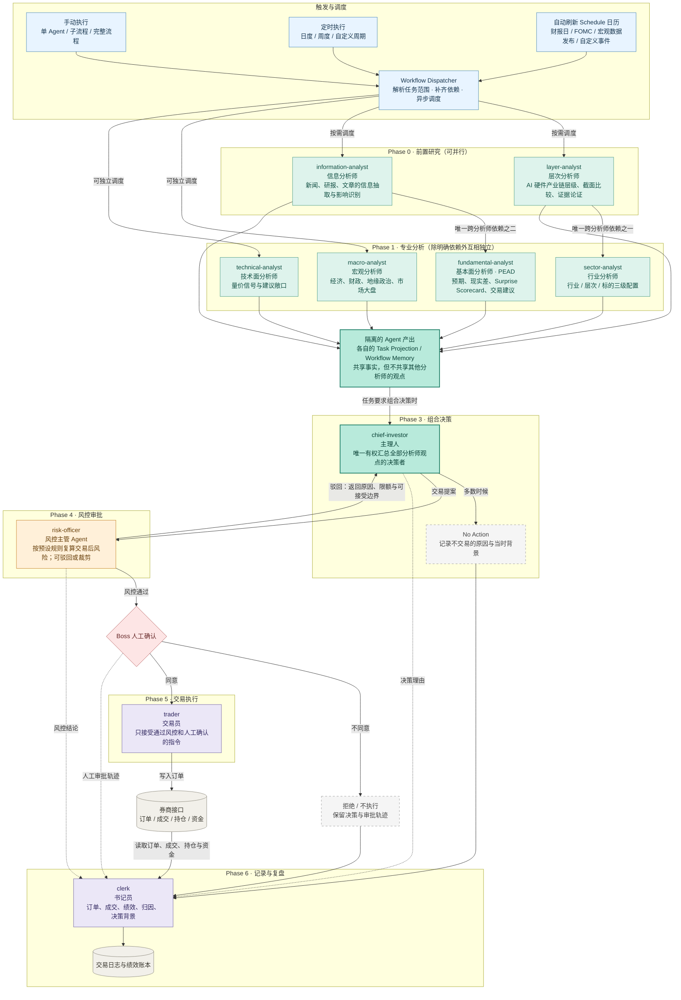
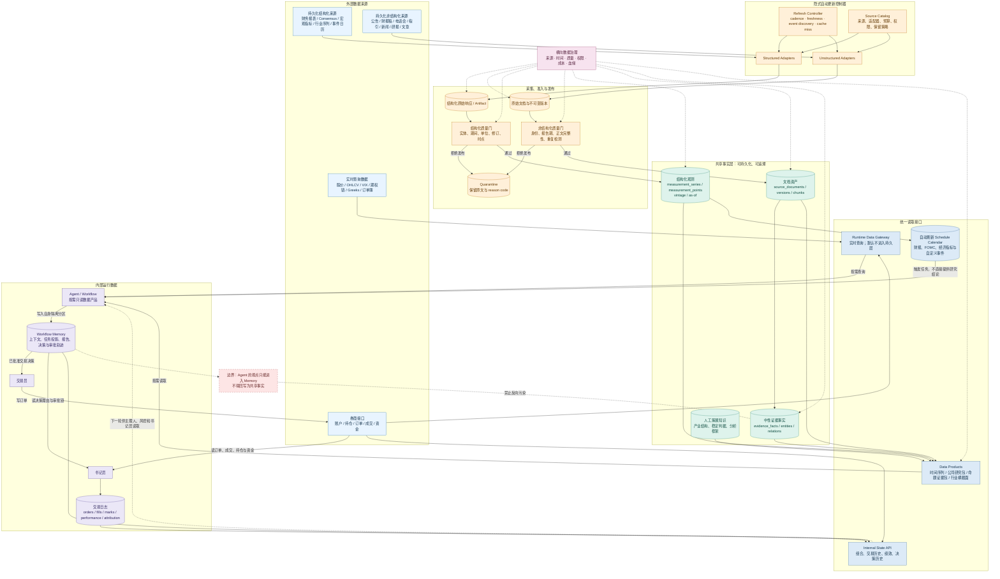
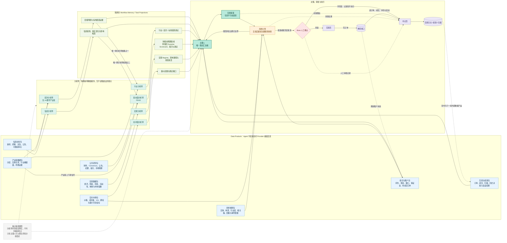
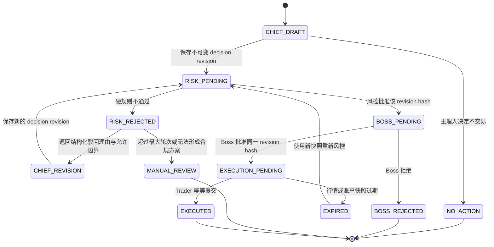

# Workflow 与 Dataflow 目标架构及实施设计

> 状态：目标架构与实施设计，经人工审阅确认，2026-09-21
>
> 边界：本文同时描述目标状态、当前实现差距和分阶段迁移方案；目标设计不等于当前已经实现。
>
> 文档定位：本文件是 Workflow、Dataflow、Agent 职责和交易审批链的唯一权威设计文档。

## 1. 设计状态、适用范围与核心原则

本文固定以下核心约束：

1. 除“层次分析师 → 行业分析师”和“信息分析师 → 基本面分析师”外，分析师互不读取彼此的观点。
2. 所有分析师共享受治理的数据事实，但只有主理人可以汇总所有分析结论并提出交易决策。
3. 数据采集和更新由数据平台隐式完成；Workflow 只按需读取数据产品，不自行拥有数据源。
4. 任何真实交易都必须绑定同一个不可变决策 revision 的风控批准和 Boss 人工批准。
5. LangGraph checkpoint 只用于运行恢复；Workflow Memory、审批记录和交易账本才是审计真相。
6. 完整交易流程缺少任何被要求的分析结果时可以产出不完整报告，但必须阻断自动交易。

原始设计中的 Phase 编号被原样保留，因此 Phase 2 暂为空缺。

## 2. 目标 Workflow



## 3. 目标 Dataflow



## 4. Data 与 Agent 对接关系



## 5. 主理人—风控主管多轮 Loop

### 5.1 状态机



### 5.2 Loop 的核心原则

1. 一个完整过程只有一个稳定的 `cycle_id`，但每次修改都产生新的、不可变的
   `decision_revision`。不得覆盖上一轮提案。
2. 风控只审查一个明确的 revision。审批结果绑定
   `decision_hash + ruleset_version + portfolio_snapshot_id + market_as_of`。
3. 风控主管不应静默修改主理人的订单。如果风控建议裁剪数量，应将它保存为结构化
   counterproposal；由主理人接受并生成新 revision，再重新通过风控。
4. 确定性的风险引擎负责计算和 pass/fail；风控 Agent 负责解释违规项、修订边界和冲突。
   LLM 的文字解释不能覆盖硬规则结果。
5. Loop 默认不重新运行分析师。主理人基于同一研究快照修改订单；只有研究材料、市场状态
   或账户状态过期时，才显式创建新快照并标记旧审查失效。
6. 必须配置最大自动轮次。默认最多 3 轮；达到上限后进入 `manual_review`，不能无限调用模型。
7. Boss 和 Trader 只能读取风控批准的同一个 revision hash。任何字段在风控后变化，都必须
   重新进入风控，避免“批准的是 A、执行的是 B”。

### 5.3 必须保存的记录

| 记录 | 关键内容 |
|---|---|
| `decision_cycles` | `cycle_id`、触发来源、研究快照、当前状态、当前 revision、最终结果 |
| `decision_revisions` | revision 序号、父 revision、完整交易提案、主理人理由、输入引用、内容 hash、模型与 Prompt 版本 |
| `decision_risk_reviews` | 被审 revision、规则版本、组合/行情快照、审批结果、违规项、裁剪建议、交易前后风险指标 |
| `boss_approvals` | 被审 revision hash、批准/拒绝、审批人、时间、备注 |
| `cycle_events` | 每次状态转换、操作者、时间、幂等键、错误或恢复信息 |
| `orders` / `fills` | 执行所对应的 cycle、revision 和 approval，券商订单号、成交与取消结果 |

风控驳回应使用结构化格式，而不只是一段自然语言。例如：

```json
{
  "verdict": "reject",
  "decision_revision": 2,
  "violations": [
    {
      "rule_id": "single_entity_weight_cap",
      "entity": "NVDA",
      "limit": 0.10,
      "post_trade_value": 0.134,
      "severity": "hard"
    }
  ],
  "allowed_boundary": {
    "max_additional_notional": 12500,
    "blocked_actions": ["increase_risk"]
  }
}
```

该结构既能成为主理人下一轮的精确输入，也能让书记员和后续复盘区分：是投资判断改变，
还是订单仅因风险预算被压缩。

### 5.4 与当前实现的映射

当前 `src/ats/graph/chief.py` 是单次通过：

```text
chief_decide → risk_gate → persist_decision → boss_review → trader
```

`risk_gate` 会直接过滤或裁剪 `state.decisions`，但不会将流程路由回主理人。因此，实现目标
Loop 时建议做以下演进：

1. 在 `ChiefDecisionState` 增加 `revision_no`、`decision_hash`、`risk_round`、
   `risk_review`、`portfolio_snapshot_id`、`max_risk_rounds` 和 `cycle_status`。
2. 将 `risk_gate` 的输出从 `decisions + risk_notes` 升级为结构化 `RiskReview`，保留原提案，
   不在原对象上静默覆盖。
3. 新增 `chief_revise` 节点，并在 `risk_gate` 后使用 conditional edge：通过去 Boss，驳回去
   `chief_revise`，超过轮次上限去人工复核。
4. 把“保存决策”拆成按轮保存 revision 和保存 risk review；消费 PEAD 信号、生成最终报告等
   一次性副作用只在 cycle 进入终态时执行，不能每轮重复。
5. 继续使用 LangGraph checkpointer 解决暂停和跨进程恢复，但将它视为运行恢复设施；正式审计
   记录仍写入领域数据库，不能把 checkpoint 当成永久交易账本。
6. 


建议的图节点变为：

```text
assemble_context
  → chief_decide
  → persist_revision
  → risk_gate
      ├─ reject  → persist_risk_review → chief_revise ─┐
      │                                                └→ persist_revision → risk_gate
      ├─ approve → persist_risk_review → boss_review → trader
      └─ exhausted → manual_review → END
```

## 6. 当前实现盘点与差距

本节记录目标设计与当前仓库之间的映射。“保留”表示能力和大部分实现可以继续使用，
不表示完全不需要改动接口、依赖边界或存储方式。

| 组件 | 处置 | 当前基础 | 目标变化 |
|---|---|---|---|
| Macro Analyst | 保留 | 已有宏观数据组装、LLM 分析和 `MacroReview` | 取消其作为 Sector、Fundamental 和 Risk 的上游观点来源 |
| Technical Analyst | 保留 | 已有量价和风险信号 | 实时数据统一经 Runtime Data Gateway 读取 |
| PEAD 核心 | 保留并重构 | 已有 prep、score、dossier、expectation、scorecard 和财报窗口 | 拆为例行预期更新和财报事件分析 |
| 确定性风险引擎 | 保留 | `risk/assess.py`、`risk/marginal.py` 和 `risk/checks.py` 已提供多维风险计算 | 只负责硬规则和交易后模拟，不静默修改订单 |
| Trader / IBKR | 保留并收紧 | 已有下单、order reference 和部分幂等能力 | 只执行绑定完整审批链的 revision |
| Journal、绩效、reconcile | 保留并整合 | `journal/`、Trader reconcile 和 performance 已覆盖大部分计算 | 由 Clerk 统一编排、对账和发布 |
| 数据平台 | 保留 | 已有结构化、非结构化、数据产品、准入和 quarantine | 补齐统一 Agent 读取边界和事件日历 |
| Layer Analyst | 拆出并重构 | `agents/sector/layer_review.py` 和横截面分析可复用 | 只输出产业层级、标的对比和证据，不给配置结论 |
| Sector Analyst | 重构 | 已有 cross-section、structure、rotation 和报告 | 独占行业、层次、标的三级配置权 |
| Information Analyst | 新建独立角色 | 能力散落在 PEAD research、triage、monitor 和 digest | 形成独立输入、输出、存储和调度契约 |
| Fundamental Analyst | 重构依赖 | 已有较完整 PEAD 实现 | 只允许读取 Information 投影及共享事实，不执行最终交易风控 |
| Chief | 重构 | `graph/chief.py` 已有一次决策和 Boss interrupt | 成为唯一观点汇总者，产生不可变 revision |
| Risk Officer | 重构 | 已有组合风险 memo 和确定性 pre-trade check | 增加结构化 transaction review、counterproposal 和多轮 Loop |
| Clerk | 新建确定性服务 | 尚无独立角色 | 整合审批、订单、成交、绩效、归因和背景记录 |
| Scheduler | 重构 | `runtime/scheduler.py` 是单 worker 的硬编码串行流程 | 替换为 Dispatcher、Schedule Calendar 和 Trigger Ledger |

### 6.1 已确认的当前冲突

1. Sector 当前会读取 Macro、PEAD 和其他研究观点，与独立性约束冲突。
2. PEAD 当前会读取 Sector 和 Macro 报告，并在 Chief 之前提前执行交易风控。
3. Risk Officer 的组合报告当前会使用 Macro 观点，目标实现中应只依赖决策、组合、市场和规则。
4. Chief—Risk 当前只有单次通过；`risk_gate` 会过滤或裁剪原决策，不会返回 Chief 修订。
5. Boss 当前可以在风控后修改或新增指令，新内容可能绕过风控。
6. Scheduler 当前硬编码串行调用；共享 SQLite 连接也不支持可靠的真并发写入。
7. Information 能力散落且为 PEAD 服务，没有独立 Task Projection、保留策略和调度入口。
8. Clerk 尚不存在，相关能力分散于 Trader、Journal、reconcile 和 performance。
9. `TradingMemory` 采用进程内缓存的共享 SQLite 连接，限制了调度器的并发模型。

## 7. Agent 详细职责和输入输出契约

### 7.1 通用 Task Projection

所有 Agent 使用同一外层 envelope 写入 Workflow Memory，payload 再由角色专用 schema
校验。不允许只保存一段无法机器解析的报告文本。

```text
TaskProjection
  projection_id
  workflow_run_id
  agent_role
  scope
  as_of
  valid_until
  schema_version
  input_refs
  data_vintage_refs
  model_version
  prompt_version
  payload
  content_hash
  status
```

`scope` 定义标的、行业、产业层或组合范围；`input_refs` 指向依赖的 Task Projection；
`data_vintage_refs` 指向共享数据产品的 as-of/vintage。`content_hash` 对规范化 payload
和关键输入引用计算，用于缓存、幂等和审计。

### 7.2 角色契约

| 角色 | 可读输入 | 目标输出 | 明确禁止 |
|---|---|---|---|
| Layer Analyst | 产业链知识、实体关系、行业横截面、命题证据 | `LayerAnalysis` | 不给出超配/低配/清仓结论 |
| Information Analyst | 通过准入的新闻、公告、研报、文章、电话会材料 | `InformationBrief` | 不输出买卖、仓位或组合建议 |
| Sector Analyst | 共享行业事实、`LayerAnalysis` | `SectorAllocation` | 不读取 Information、Fundamental、Macro、Technical 观点 |
| Fundamental Analyst | 公司研究包、产业链事实、`InformationBrief` | `FundamentalExpectationUpdate` / `FundamentalEventReview` | 不读取 Sector 或 Macro 观点，不执行最终风控 |
| Macro Analyst | 宏观数据包、政策和地缘文档 | `MacroReview` | 不读取其他分析师观点 |
| Technical Analyst | 实时市场包和量价派生指标 | `TechnicalReview` | 不读取其他分析师观点 |
| Chief | 全部被要求的分析投影、组合、历史和绩效 | `ChiefDecisionRevision` | 不能越过 Risk 或 Boss 到 Trader |
| Risk Officer | 交易提案、组合快照、市场快照、规则包 | `DecisionRiskReview` | 不读取分析师观点，不静默改单 |
| Trader | 已通过 Risk 和 Boss 的 approval token | `ExecutionResult` | 不接受未审批的决策或任意文本指令 |
| Clerk | 决策审计链、券商回报、交易历史 | 账本、绩效、归因、异常项 | LLM 不得生成或修改账本事实 |

### 7.3 目标 payload

- `LayerAnalysis`：产业链层级、实体关系、标的横截面排名、共同证据和差异证据。
- `InformationBrief`：来源文档、事实变化、影响候选、关联实体、置信度、时效和待核验项。
- `SectorAllocation`：行业、层次、标的三级配置及其事实引用。
- `FundamentalExpectationUpdate`：财报前预期、市场隐含预期、核心叙事和变化路径。
- `FundamentalEventReview`：现实与预期差、Surprise Scorecard、指引变化、叙事更新和投资建议。
- `MacroReview`：regime、影响传导、情景、时间范围和主要风险。
- `TechnicalReview`：量价读数、趋势状态、失效条件和建议敞口。
- `ChiefDecisionRevision`：完整交易提案或 No Action、研究投影引用、决策理由和可验证假设。
- `DecisionRiskReview`：硬规则结果、交易前后指标、违规项、允许边界和 counterproposal。

## 8. Workflow Dispatcher 与调度设计

### 8.1 运行模型

Dispatcher 是普通 Workflow 的唯一调度入口，不要求所有 Workflow 都实现为 LangGraph。

```text
WorkflowTaskSpec
  workflow_id
  agent_role
  dependencies
  trigger_modes
  input_contract
  output_schema
  freshness_policy
  timeout
  retry_policy
  resource_group

WorkflowRunRequest
  run_id
  trigger_context
  requested_workflows
  scope
  as_of
  enter_decision_cycle

WorkflowRunResult
  run_id
  task_results
  projection_refs
  missing_requirements
  terminal_status
```

### 8.2 依赖与并发

1. Phase 0 的 Layer 与 Information 可并行。
2. Macro 和 Technical 没有分析师依赖，可在任务启动后立即并行。
3. Sector 只等待 Layer；Fundamental 只等待 Information。
4. 手动单独运行 Sector 或 Fundamental 时，Dispatcher 自动补齐其唯一依赖。
5. 若存在未过期、scope 相容、schema 相容且关键数据 vintage 未变的依赖投影，可直接复用。
6. 完整交易流程必须等待全部被要求的分析任务进入成功终态。
7. 必要分析失败、缺失或过期时，运行状态为 `incomplete`；可发布缺口报告，但不得进入 Chief。
8. 分析型子流程默认在产出 Task Projection 后结束，只有 `enter_decision_cycle=true` 才进入 Chief。

### 8.3 触发和幂等

手动、定时和事件触发都转换为 `TriggerContext`。每个任务生成稳定 idempotency key，
重启或 misfire 补偿不得重复产生同一逻辑任务。失败重试只重试该任务，不得无条件重跑已成功依赖。

### 8.4 LangGraph 的使用边界

- PEAD 财报事件流程保留 LangGraph，因为它具有分阶段状态、可恢复执行和延迟文档升级。
- Chief—Risk—Boss—Trader 保留 LangGraph，因为它需要多轮循环和人工 interrupt。
- Layer、Information、Sector、Macro、Technical 的单次分析不为了统一形式而强制引入 LangGraph。

### 8.5 SQLite 并发基线

- 每个运行或 worker 使用独立连接，不共享全局 `sqlite3.Connection`。
- 启用 WAL 和可配置 busy timeout。
- 写操作使用短事务，远程请求和 LLM 调用不得包含在数据库事务内。
- 以唯一约束和幂等写入解决重试，不依赖进程内锁保证正确性。

## 9. Information Analyst 与 Fundamental/PEAD 双模式

### 9.1 Information Analyst

Information Analyst 处理的是多类信息资产，因此公开角色名不使用 News 或 Intelligence。

输入必须是已通过数据平台准入的文档、chunk 或中性证据事实；Agent 不得在执行中
直接调用新闻、研报或公告 Provider。输出必须保留每个结论的文档版本、片段位置、
事件时间、抽取时间和置信度。

迁移时复用：

- `agents/pead/research.py` 的文章/通讯抽取能力。
- `agents/pead/triage.py` 的材料性评估。
- `agents/pead/monitor.py` 中与文档识别相关的逻辑，但移除直接更新 PEAD dossier 的副作用。
- `runtime/digest.py` 和现有 `intel-brief` 的摘要能力；旧名仅作为迁移期内部标识。

### 9.2 Fundamental 例行模式

例行模式在新 InformationBrief、产业链事实或预期数据发生有效变化时运行：

1. 读取上一个有效财报前基线。
2. 将新信息分为确认、否定、新增或尚待验证。
3. 更新市场隐含预期、主要叙事、关键 KPI 和可证伪条件。
4. 产生 `FundamentalExpectationUpdate`，不产生可执行订单。

### 9.3 Fundamental 事件模式

事件模式以财报或明确公司事件为触发器：

1. 在事件 cutoff 冻结财报前预期基线和引用。
2. 只使用报告期间正确且通过准入的 actuals、earnings release、指引和电话会。
3. 分别计算实际值相对基线、Consensus 和市场隐含预期的差异。
4. 生成 Surprise Scorecard、指引评估、叙事转变和 `FundamentalEventReview`。
5. 电话会迟到时可生成新版本，但不覆盖早期版本。

Fundamental 不再读取 Sector 或 Macro 报告，也不再调用最终组合 pre-trade check。
上下游信号必须以共享事实或 Data Product 形式输入，不能通过另一个分析师的观点绕过依赖约束。

## 10. Chief—Risk—Boss—Trader 审批链

### 10.1 决策快照

Chief 开始决策时必须固定一份 `research_snapshot`，其中列出每个被要求角色的
projection ID、content hash、as-of 和新鲜度状态。Loop 默认不重跑分析师；若研究快照本身失效，
当前 cycle 应转为 `superseded` 或人工处理，不在原 revision 中偷换研究输入。

### 10.2 Revision 和风控

1. `decision_revision` 内容不可变，新版本必须引用 `parent_revision` 和修订原因。
2. `decision_hash` 由规范化交易指令、决策理由和关键输入引用计算。
3. 确定性风险引擎负责 pass/fail 和交易前后指标；Risk Agent 只负责解释、聚合冲突和生成结构化边界。
4. Risk 提出的数量裁剪或替代方案是 counterproposal，由 Chief 接受后生成新 revision。
5. 默认最多 3 轮自动修订；超过后进入 `manual_review`，不进入 Boss 或 Trader。

### 10.3 Boss 审批

Boss 界面只提供“批准”和“拒绝”。审批对象必须显示 revision hash、风控结论、组合快照时间
和交易摘要。Boss 的修改意见以拒绝备注形式保存，由 Chief 创建新 revision，再次通过 Risk。

重复回调使用 approval idempotency key 返回原结果；针对旧 revision、已终结 cycle 或已失效风控结果的审批
必须拒绝，不得依赖进程内集合去重。

### 10.4 Trader 入口

Trader 只接收结构化 `ExecutionAuthorization`：

```text
ExecutionAuthorization
  cycle_id
  revision_no
  decision_hash
  risk_review_id
  risk_approved_at
  boss_approval_id
  boss_approved_at
  ruleset_version
  portfolio_snapshot_id
  market_as_of
```

执行前必须重新获取时间。市场或账户快照默认超过 60 秒则当前 authorization 失效，
使用新快照重新进入 Risk，通过后必须重新获得 Boss 批准。实际阈值应置于风控配置中，
不允许运行时静默放宽。

Trader 的 client order ID 由 cycle、revision 和订单序号稳定生成。同一授权和订单序号不得重复提交。

## 11. Clerk 与交易账本

Clerk 是确定性 Workflow Service，而不是依靠 LLM 生成账本的 Agent。各业务服务在事件发生时
以事务性写入自己的领域记录；Clerk 负责串联、对账、补偿和发布读模型，不是在事后猜测事实。

### 11.1 职责

- 记录 research snapshot、decision revision、Risk 审查、Boss 审批和每次状态转换。
- 读取券商订单、部分成交、完全成交、撤单、拒单、持仓和资金。
- 复用现有 reconcile、marks、performance、episodes、predictions 和 attribution。
- 区分系统订单、人工订单和无法归因订单；无法归因不等于忽略。
- 对迟到成交、部分成交和漏跑日期进行可重放补偿。
- 将交易历史、绩效和归因发布为 Internal State API，供下一轮 Chief、Risk 和 Clerk 读取。

### 11.2 LLM 边界

现有 critic 可用于低频复盘叙事，但它的输出是附加分析，不是 order、fill、position、PnL
或 attribution 的事实来源。LLM 无权回写或覆盖券商和确定性计算结果。

## 12. 数据边界、Workflow Memory 与持久化模型

### 12.1 数据边界

1. 持久化结构化和非结构化数据只通过 Data Products 提供。
2. 价格、期权链、账户、持仓和订单状态通过 Runtime Data Gateway 查询。
3. Agent 不得直接调用 Provider、不得把自己的观点回写成共享事实。
4. Data Platform 可以将确定性抽取的中性事实发布到共享层；含观点的 Agent 结论只能进入 Workflow Memory。
5. Internal State API 只发布组合、交易、绩效、决策和审批状态，不与外部研究事实库混合。

### 12.2 通用运行存储

| 表 | 用途 |
|---|---|
| `workflow_runs` | 一次用户或调度器请求的整体运行和终态 |
| `agent_runs` | 单个 Agent 任务的输入、重试、运行时间和错误 |
| `task_projection_envelopes` | 统一 envelope、类型化 payload、输入引用和 content hash |
| `trigger_runs` | 手动、定时和事件触发的幂等记录 |

现有 `pead_dossier`、`sector_reviews`、`macro_reviews` 等表在迁移期保留为兼容读模型。
新流程以 `task_projection_envelopes` 为通用引用层，不要求在第一阶段破坏所有旧报表和 CLI。

> 已裁决（2026-09-22）：统一 envelope 由**新建的独立表** `task_projection_envelopes` 承载，
> **不复用**既有 `task_projections` 同名表。理由是既有表的键语义（`profile` / `target_type` /
> `target_id` / `input_kind` / `input_ref`）服务于证据事实投影，与目标 envelope 的
> `agent_role` / `scope` / `data_vintage_refs` / `content_hash` 并非同一抽象；原地改列会让既有
> 查询与测试同时失效。既有 `task_projections` 保留为兼容读模型，其旧列的退出登记见 Phase A
> change 的待退项登记表，退出条件为「读取方全部切换到新表且旧表零写入」。

### 12.3 决策与交易审计

| 表 | 关键内容 |
|---|---|
| `decision_cycles` | trigger、research snapshot、当前状态、当前 revision、终态 |
| `decision_revisions` | 不可变提案、parent revision、理由、输入引用、hash、模型和 prompt 版本 |
| `decision_risk_reviews` | revision hash、ruleset、组合/市场快照、违规项、边界和指标 |
| `boss_approvals` | revision hash、决定、审批人、时间和备注 |
| `cycle_events` | 追加式状态转换、actor、幂等键、错误和恢复信息 |

现有 `orders` 和 `fills` 增加可空的 `cycle_id`、`revision_no`、`decision_hash` 和
`approval_id` 关联字段。现有用于组合快照的 `risk_reviews` 保留，不与新的
`decision_risk_reviews` 混用。

### 12.4 迁移原则

- 所有 schema 变更首先使用 additive migration，不删除旧表或旧列。
- 只对能可靠映射的历史决策创建 legacy revision。
- 无法还原原始提案、输入快照或 hash 的历史数据标记为 `legacy_unknown`，不伪造审计字段。
- 在新写路径稳定前保留旧读入口，并使用读模型或双写适配层过渡。
- **旧实现的退出必须经墓碑登记**：在登记处留下墓碑（含替代实现、目标相位与退出条件）；
  同一标识不得同时存在于「在用」与「已退役」，两处并存即配置加载失败；读取命中墓碑须
  fail-closed 返回显式退役原因码，不得静默回退到替代实现；物理清除默认只读干跑，须显式确认
  才执行，并记录动作、范围与备注。该模式已在结构化来源上验证（`retired_sources` 墓碑 +
  `purge-source` 两段式清除），Workflow 侧沿用同一模式，不另立标准。
- **兼容迁移保护的是旧读入口**。已被边界归类判定为数据层所有的表不适用「保留旧表」原则——
  它们的失效是边界决策的结果，正确处置是补齐另一侧的归属（见 §3 与 §7.1），而不是恢复旧表。
  迁移若确需分阶段完成，未迁移的一侧必须被显式登记，不得以静默方式继续写入旧存储。
- **每个阶段必须登记其待退旧实现**，逐项写明替代实现、退出条件与依赖消费方清零的判据；
  条件未满足者标注「待退」并说明所缺条件，不得省略登记。

## 13. 自动事件日历

### 13.1 首期范围

- 公司财报日期及 BMO/AMC/盘中窗口。
- FOMC 会议、决议和发布会。
- CPI、PCE、NFP、GDP 等核心宏观发布。
- 人工创建的公司、行业或系统事件。

`config/events.yaml` 保留为人工覆盖和自定义事件层，不再作为可自动发现事件的主数据源。

### 13.2 `schedule_events`

```text
schedule_event
  event_id
  event_version
  event_type
  entity_or_symbol
  scheduled_at
  timezone
  session
  status
  source_id
  source_lineage
  announced_at
  fetched_at
  revised_at
  payload_hash
```

同一外部事件使用稳定 `event_id`；时间、状态或关键 payload 修订时增加 `event_version`，
保留历史版本。日期改动时取消尚未执行的旧触发，为新版本创建触发。

Workflow 触发幂等键是：

```text
event_id + event_version + workflow_id
```

事件日历只决定何时调度哪个 Workflow，不向 Agent 注入研究结论。休市、进程休眠、misfire
和重启后的补偿策略必须由 trigger ledger 可观测，不能只存在调度器内存中。

## 14. 分阶段迁移方案

### 14.1 阶段 A：稳定基线与契约

- 把项目既有的 `uv` 完整依赖入口固定为唯一的环境与测试入口，并把测量条件随基线数字一并记录。
- 完成数据层写侧 cutover：补齐数据层证据表的写入侧 schema 与写入接口，把证据写入从已被边界
  归类删除的旧表改指数据层。读侧早已完成，缺的正是这一半。
- 修复 PEAD action 枚举大小写漂移和期权到期桶边界问题。
- 建立 Agent 依赖和数据边界的架构测试。
- 定义 Task Projection、WorkflowRun 和 TriggerContext 契约。
- 建立旧实现退役登记机制，并登记首批待退项与各自的退出条件（本阶段只登记，不执行任何清除）。

### 14.2 阶段 B：决策审计与交易安全

- 新增 decision cycle、revision、transaction risk review、Boss approval 和 cycle event 模型。
- 实现 Chief—Risk 多轮 Loop，移除 Risk 静默裁剪。
- 将 Boss 入口限定为批准/拒绝，绑定 revision hash。
- 在 Trader 入口强制校验 ExecutionAuthorization 和新鲜度。
- 所有手动和自动交易指令进入同一审批链。

### 14.3 阶段 C：Clerk 和交易账本

- 建立 Clerk 编排层，整合现有 reconcile、journal、marks、performance 和 attribution。
- 实现订单/成交与 cycle/revision/approval 的强关联。
- 增加迟到成交、部分成交、人工订单和漏跑补偿。

### 14.4 阶段 D：分析师职责重构

- 从 Sector 拆出 Layer，将配置权收口到 Sector。
- 建立 Information Analyst，迁移现有抽取、triage 和 digest 能力。
- 将 Fundamental 拆成例行和事件模式，删除越界依赖和内部交易风控。
- 移除 Sector 对 Macro、PEAD 和研究观点的依赖。
- 移除 Risk Officer 对 Macro 观点的依赖。
- 扩展 Chief 以读取六类分析投影和固定 research snapshot。

### 14.5 阶段 E：Dispatcher 与事件日历

- 将硬编码 Scheduler 迁移到任务注册、依赖解析和并发执行。
- 完成 SQLite 连接和幂等写入重构。
- 发布 Schedule Calendar 数据产品和 trigger ledger。
- 迁移财报、FOMC、核心宏观事件和人工覆盖。

### 14.6 阶段 F：影子运行与切流

- 新旧分析和调度路径并行运行，新路径默认禁止真实下单。
- 比较输入快照、分析输出、调度遗漏、风控结果和交易归因。
- 通过阶段性验收后分别切换读路径、调度路径和交易路径。
- 迁移窗口内保留旧入口作为可控回滚路径；不同时保留两个可下真单的入口。

## 15. 可靠性测试与验收标准

### 15.1 当前基线

权威测量：2026-09-22，`uv run pytest` 全量，执行环境不设文件删除配额，环境为 `uv` 托管的
CPython 3.12.12。

- **权威基线**：**135 failed / 1398 passed / 22 warnings（170.50s）**，其中 **error = 0**。
- **环境入口**：`uv sync --all-extras`（57 秒）后全部可选分组可导入——`apscheduler`、
  `pandas_market_calendars`、`langgraph.checkpoint.sqlite`、`ib_async`、`fastapi`、`chromadb`、
  `duckdb`、`pytest_asyncio`。项目本就由 `uv` 管理环境（`.venv/pyvenv.cfg` 内 `uv = 0.9.25`），
  可选 extras 也已由 `pyproject.toml` 声明，缺的不是入口而是入口未被使用。
- **受限执行环境的对照**：同一命令在对文件删除设每轮 50 次配额的环境中为
  121 failed / 1149 passed / **263 errors**（411 秒）——即 14 项失败被 error 掩盖、249 项通过被掩盖。
  该环境 error 的成因是 pytest 运行期清理临时编号目录时触及删除配额，守卫以 `SystemExit`
  打断 fixture setup；`tests/conftest.py` 的 autouse fixture `_isolate_db(tmp_path, ...)` 使故障
  放大为整库失败（换**全新** `--basetemp` 仍复现，实测 `22 passed / 1511 errors`，13 秒）。
  **受限环境的计数不得用作验收判据**；权威基线须在不受该配额约束的环境中取得。

**失败归因（135 项，按簇）**

| 簇 | 数量 | 性质 |
|---|---:|---|
| 旧表缺失 `sqlite3.OperationalError: no such table` | 101 | 数据层写侧 cutover 半途（单一根因） |
| 接口签名漂移（`consumer` 9、`legacy_repository` 3） | 12 | 同一迁移的读侧衍生物 |
| 证据与边界语义断言 | 3 | 同一迁移的读侧衍生物 |
| 调度接线与阶段序列漂移 | 5 | 待逐项归因 |
| 采集返回空（news / yahoo / regional） | 6 | 待逐项归因 |
| 配置与 CLI 文档漂移 | 3 | 待逐项归因 |
| 缺陷 ②（action 词表）与 ③（到期桶） | 2 | 已定位到代码行 |
| 其余单项 | 3 | 待逐项归因 |

101 项旧表缺失按表计：`source_documents` 47、`evidence_observations` 33、`data_sources` 10、
`newsletter_cursors` 4、`document_candidates` 3、`measurement_series` 2、`document_versions` 1、
`evidence_failures` 1。**8 张表全部位于 `TradingMemory._retire_data_tables()` 的 DROP 名单内**
（`src/ats/memory/store.py:381-394`）；受影响测试文件 33 个。

- **缺陷 ①（系统性，116 项 = 86%）**：数据层搬迁只完成读侧，写入仍指向已被边界归类删除的旧表，
  收口于 `TradingMemory.save_observation()`，波及 chain、scheduler、data-products、
  document-assets 等多条链路。修复方向是**补齐数据层写侧并改指写入路径**，而不是恢复旧表。
- **缺陷 ②（1 项）**：PEAD action 枚举大小写与取值漂移（`schemas/decision.py:11` 5 值 /
  `schemas/pead.py:203` 4 值缺 `add` / `schemas/journal.py:121` 裸 `str`；
  `tests/test_pead_graph.py:160` 使用大写 `BUY`）。
- **缺陷 ③（1 项）**：期权到期桶边界为闭区间，0 天与 30 天到期被并入同一桶
  （`src/ats/risk/assess.py:227-240`；`tests/test_risk.py::test_sell_put_survival_separates_expiry_dates`）。

三项必须在开始架构切换前消除。**其余 17 项独立失败**（调度接线、采集返回空、配置与 CLI 文档等）
尚未归因，按 Phase A 的验收要求逐项归因并登记；Phase A 不承诺将其清零。

原文记录的「111 passed、11 failed、8 errors」是针对性子集运行的结果。其对失败的归因
（缺少 APScheduler、pandas-market-calendars 与 LangGraph SQLite checkpointer）方向正确，
但修复方式是使用项目既有的 `uv` 完整依赖入口，而不是新增一套安装方式。

**入口与测量纪律**：唯一入口为 `./scripts/run_tests.sh`（`uv sync --all-extras` +
`uv run pytest`）。测量条件（命令、依赖范围、执行环境限制与影响范围）与「环境性失败 vs 业务回归」
的判据记在 [`docs/TEST_BASELINE.md`](TEST_BASELINE.md)——引用本节的任何基线数字时，必须连同
那里的测量条件一起读。

### 15.2 Chief—Risk—Boss—Trader

- 首轮风控通过、一次驳回后通过、多次驳回后通过、全部驳回和超过 3 轮。
- No Action 必须生成终态及原因，不进入 Risk、Boss 或 Trader。
- 每个 LangGraph 节点前后模拟进程崩溃，恢复后不重复写 revision、review、approval 或 order。
- Boss 重复回调、过期回调、针对旧 revision 的回调和针对已终结 cycle 的回调。
- Boss 修改意见不得产生可直接执行的新订单。
- 市场或组合快照过期时必须重新风控和重新人工批准。
- 所有执行订单必须能联接到唯一 decision revision、risk review 和 Boss approval。

### 15.3 Dispatcher 和依赖隔离

- 手动单 Agent、依赖子流程和完整流程。
- Layer/Information 并行，Sector/Fundamental 只等待自己的依赖。
- 有效投影复用、过期投影重跑、schema 不兼容和 data vintage 变化。
- 一个分析任务失败不取消与它无关的分析，但必须阻断要求完整输入的交易流程。
- 架构测试扫描 Agent 导入和 Task Projection 读取，阻止直接 Provider 调用和未声明跨分析师依赖。

### 15.4 Calendar 和 Clerk

- 事件改期、取消、重复源记录、时区、休市、misfire 和重启补偿。
- 同一 `event_id + event_version + workflow_id` 只能生成一次逻辑触发。
- Trader 的同一 client order ID 不重复下单。
- Clerk 对部分成交、迟到成交、撤单、拒单、人工订单、无法归因订单和进程重启的处理。
- 绩效和归因可从不可变原始记录重建，重建不改变原始事实。

### 15.5 上线门禁

1. 现有核心测试在固定的完整测试依赖下全绿。
2. 新增的状态机、幂等、依赖隔离、Calendar 和 Clerk 测试全绿。
3. 新流程完成影子运行，期间无未审批真实下单。
4. 所有影子订单都能追溯到研究快照、revision、Risk 和 Boss 批准。
5. 回滚步骤已演练，并且任何时刻只有一条可执行真实交易的入口。

## 16. 已确认的架构决策

1. 角色公开名称为 `Information Analyst / 信息分析师`，代码标识使用 `information-analyst`。
2. Layer Analyst 与 Sector Analyst 严格拆分；配置权属于 Sector Analyst。
3. Clerk 是确定性服务；LLM 只能产生不影响账本的附加复盘。
4. 迁移采用分阶段兼容方式，不一次性破坏旧表、CLI 和报表。
5. Boss 只能批准或拒绝；修改意见必须由 Chief 生成新 revision 并重新风控。
6. 事件日历首期覆盖财报、FOMC、CPI、PCE、NFP、GDP 和人工自定义事件。
7. 完整流程中任一被要求的分析失败、缺失或过期时，必须阻断自动交易。
8. Chief—Risk 自动修订默认最多 3 轮，超过后进入 `manual_review`。
9. 执行前市场或账户快照默认超过 60 秒即失效，需重新风控和重新人工批准。
10. 普通分析 Workflow 由 Dispatcher 编排；LangGraph 用于 PEAD 事件流和 Chief 审批链。
11. 原有四张 Mermaid 图是本文档的正式目标架构图，不在实施章节中用另一套图替换。
12. 本次设计和文档实施不使用 OpenSpec。
